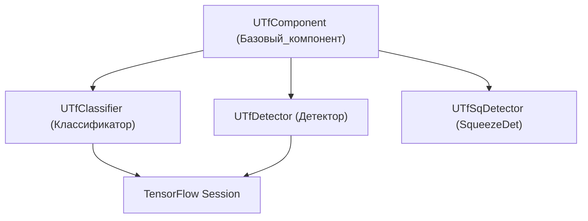
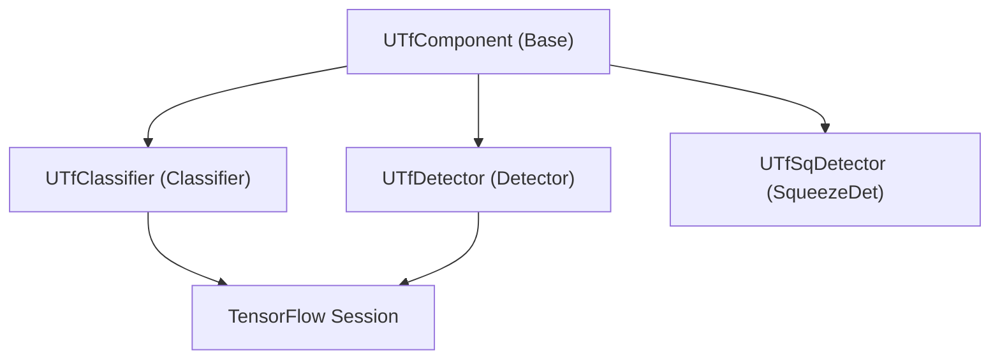

# Архитектура Rdk-TensorflowLib

## RU

### Обзор

Rdk-TensorflowLib предоставляет компонентный интерфейс для работы с TensorFlow.

### Структура библиотеки



### Основные модули

#### Базовые компоненты

- **UTfComponent** - базовый компонент для всех TensorFlow компонентов

#### Классификаторы

- **UTfClassifier** - классификатор на основе TensorFlow моделей

#### Детекторы

- **UTfDetector** - детектор объектов на основе TensorFlow
- **UTfSqDetector** - детектор SqueezeDet на основе TensorFlow

#### Сессии TensorFlow

- **ttfsession** - сессия TensorFlow для выполнения графов вычислений
- **ttfsessionSqDet** - сессия для SqueezeDet моделей

#### Интерфейсы

- **Interface/label_image.h** - интерфейс для классификации изображений

### Ключевые классы

#### TensorflowLib

Главный класс библиотеки.

Библиотека загружается условно:

```cpp
#ifdef RDK_USE_TENSORFLOW
libs_list.push_back(&RDK::TensorflowLib);
#endif
```

### Зависимости

- **rdk.static.qt** - ядро Rdk
- **TensorFlow** (C API) - библиотека TensorFlow
- Заголовочные файлы TensorFlow

### Особенности

- Прямая интеграция с TensorFlow C API
- Загрузка и выполнение предобученных моделей
- Работа с сессиями TensorFlow
- Поддержка различных архитектур (включая SqueezeDet)

### Примеры использования

#### TensorFlow детектор

```cpp
#ifdef RDK_USE_TENSORFLOW
// Создание TensorFlow детектора
UTfDetector* detector = storage->CreateComponent<UTfDetector>();
// Загрузка модели TensorFlow
// Детекция объектов
#endif
```

### См. также

- [Usage-Examples.md](Usage-Examples.md) - примеры использования
- [API-Overview.md](API-Overview.md) - обзор API

---

## EN

### Overview

Rdk-TensorflowLib provides a component interface for working with TensorFlow.

### Library Structure



The library wraps TensorFlow runtime into Rdk components. A typical flow is: load model → prepare input tensors → run session → map output tensors into component output properties.

### Main Modules

#### Base Components

- **UTfComponent** - base component for all TensorFlow components

#### Classifiers

- **UTfClassifier** - classifier based on TensorFlow models

#### Detectors

- **UTfDetector** - object detector based on TensorFlow
- **UTfSqDetector** - SqueezeDet detector based on TensorFlow

#### TensorFlow Sessions

- **ttfsession** - TensorFlow session for executing computation graphs
- **ttfsessionSqDet** - session for SqueezeDet models

#### Interfaces

- **Interface/label_image.h** - interface for image classification

### Key Classes

#### TensorflowLib

Main library class.

The library is loaded conditionally:

```cpp
#ifdef RDK_USE_TENSORFLOW
libs_list.push_back(&RDK::TensorflowLib);
#endif
```

### Dependencies

- **rdk.static.qt** - Rdk core
- **TensorFlow** (C API) - TensorFlow library
- TensorFlow header files

### Features

- Direct integration with TensorFlow C API
- Loading and executing pre-trained models
- Working with TensorFlow sessions
- Support for various architectures (including SqueezeDet)

### Usage Examples

#### TensorFlow Detector

```cpp
#ifdef RDK_USE_TENSORFLOW
// Create TensorFlow detector
UTfDetector* detector = storage->CreateComponent<UTfDetector>();
// Load TensorFlow model
// Object detection
#endif
```

### See Also

- [Usage-Examples.md](Usage-Examples.md) - usage examples
- [API-Overview.md](API-Overview.md) - API overview
