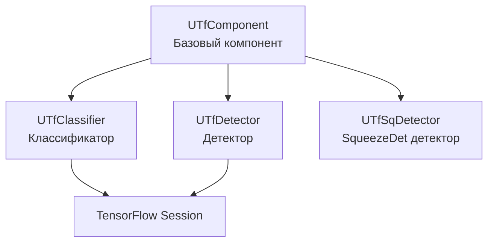

# Архитектура Rdk-TensorflowLib

## RU

### Обзор

Rdk-TensorflowLib предоставляет компонентный интерфейс для работы с TensorFlow.

### Структура библиотеки

### Основные модули

#### Базовый компонент

- **UTfComponent** - базовый компонент для работы с TensorFlow

#### Классификация

- **UTfClassifier** - классификатор изображений на базе TensorFlow

#### Детекция

- **UTfDetector** - детектор объектов на базе TensorFlow
- **UTfSqDetector** - детектор SqueezeDet

#### Сессии TensorFlow

- **ttfsession** - управление сессиями TensorFlow

### Зависимости

- `rdk.static.qt` - ядро Rdk
- TensorFlow - библиотека TensorFlow

### См. также

- [Usage-Examples.md](Usage-Examples.md) - примеры использования
- [API-Overview.md](API-Overview.md) - обзор API

---

## EN

### Overview

Rdk-TensorflowLib provides a component interface for working with TensorFlow.

### Library Structure

### Main Modules

#### Base Component

- **UTfComponent** - base component for TensorFlow operations

#### Classification

- **UTfClassifier** - TensorFlow-based image classifier

#### Detection

- **UTfDetector** - TensorFlow-based object detector
- **UTfSqDetector** - SqueezeDet detector

#### TensorFlow Sessions

- **ttfsession** - TensorFlow session management

### Dependencies

- `rdk.static.qt` - Rdk core
- TensorFlow - TensorFlow library

### See Also

- [Usage-Examples.md](Usage-Examples.md) - usage examples
- [API-Overview.md](API-Overview.md) - API overview
