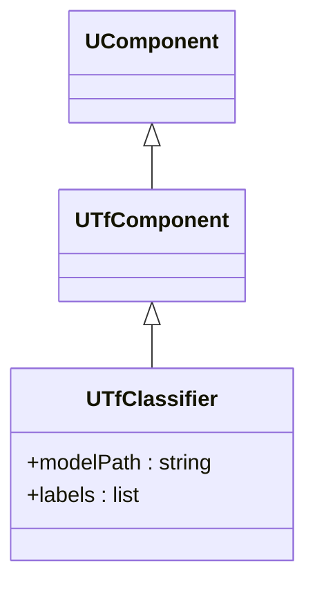
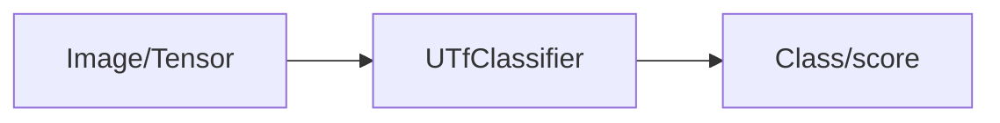
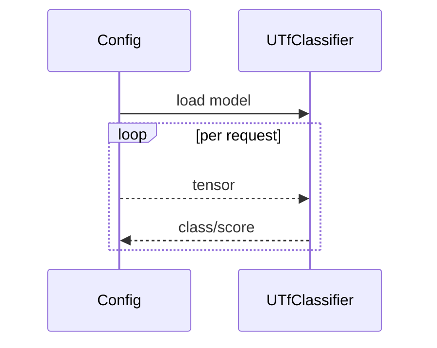

## UTfClassifier — классификатор TensorFlow

**Класс**: `UTfClassifier` (`ClassifierTF`) — инференс классификации с использованием TF-модели.  
**Регистрация**: `Core/Lib.cpp` → `UploadClass("ClassifierTF", ...)`.  
**Storage-инстансы**: `ClassName = "ClassifierTF"`; параметры: путь к модели, labels, препроцессинг.

### Входы/выходы
- Вход: изображение/тензор.
- Выход: класс/скор.

Пояснение: блок-схема показывает поток данных/сигналов (входы → компонент → выходы).

Пояснение: диаграмма последовательности показывает типовой сценарий взаимодействия и порядок вызовов.

---

## UTfClassifier — TensorFlow classifier

Loads TF model, runs classification, returns label/score.
