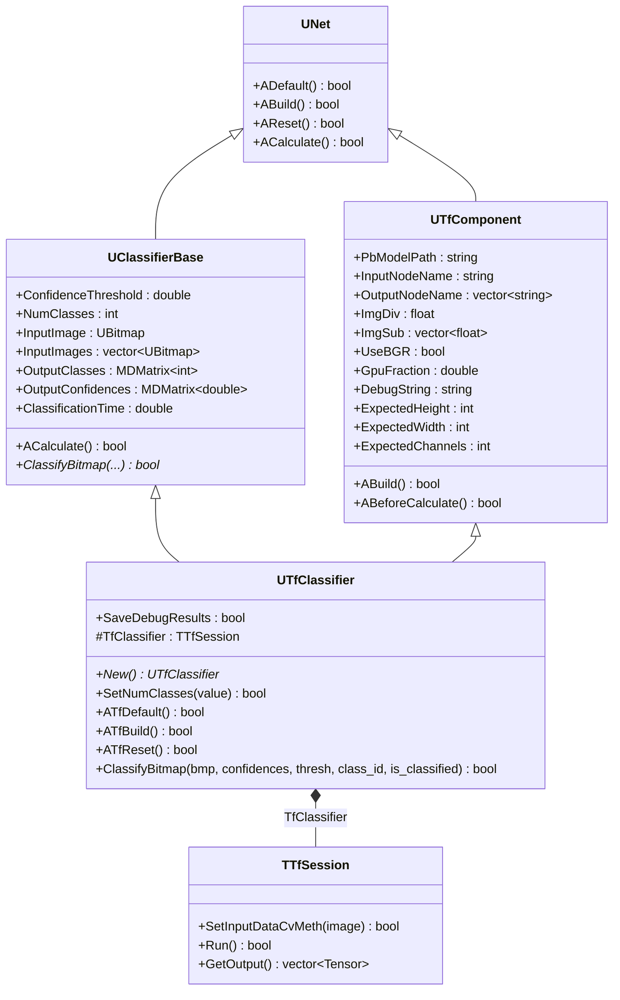
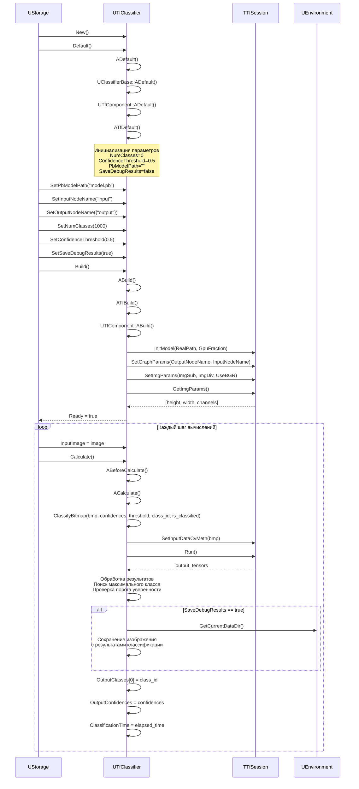
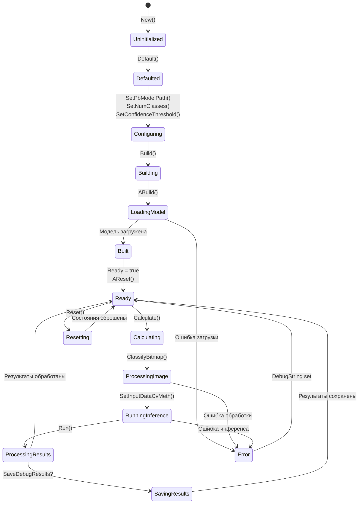
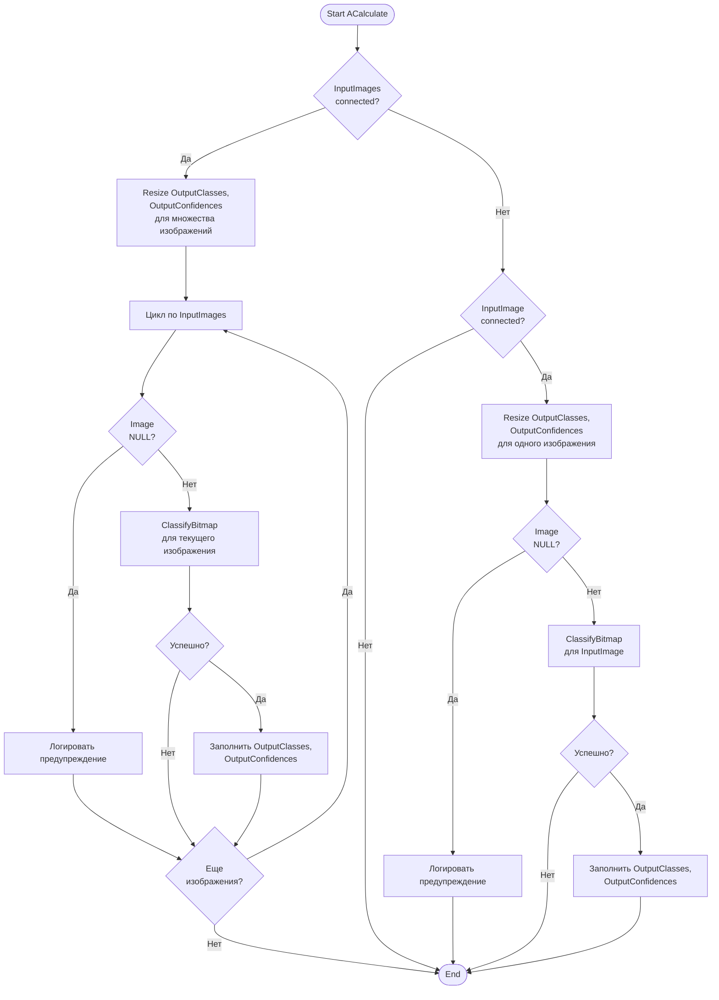
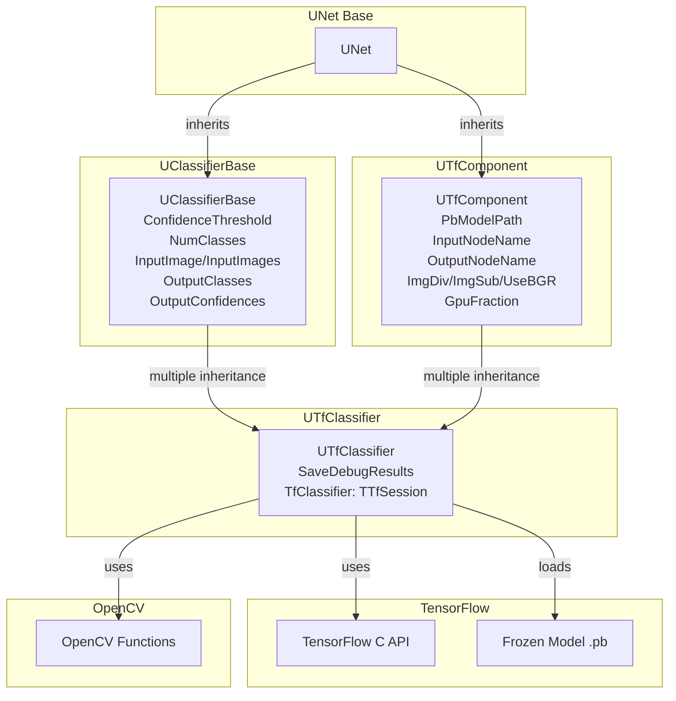
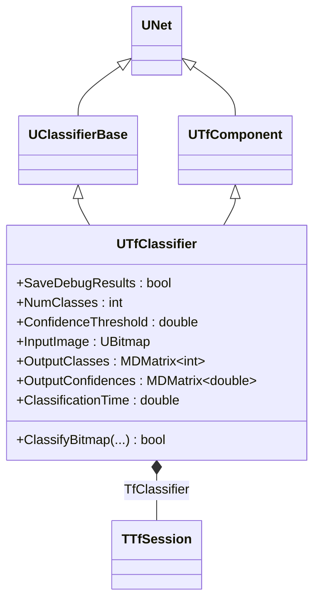
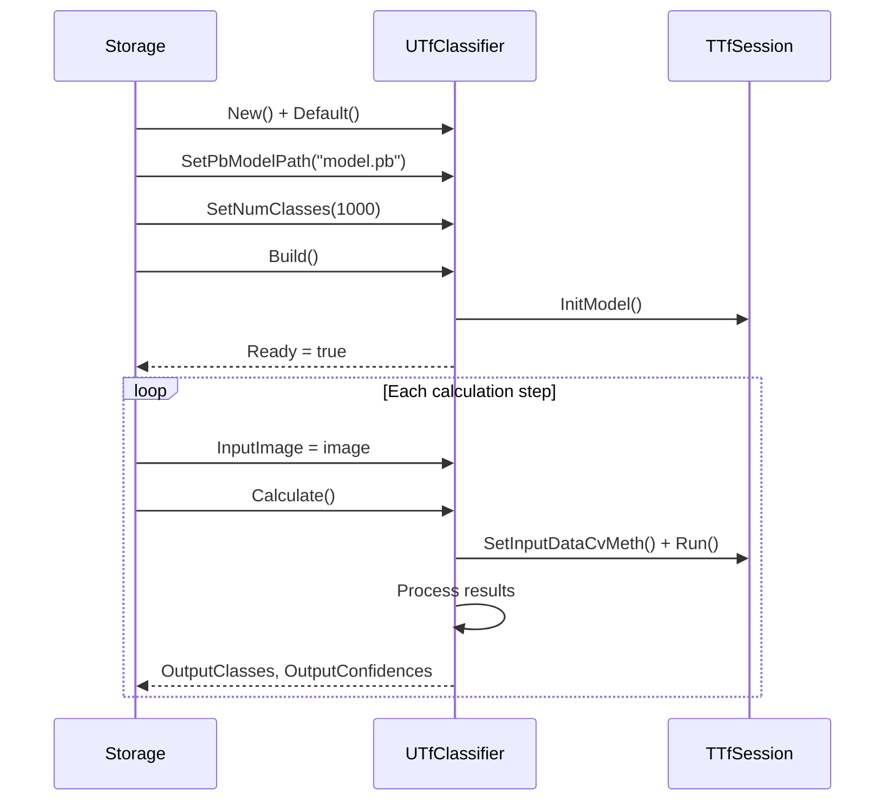
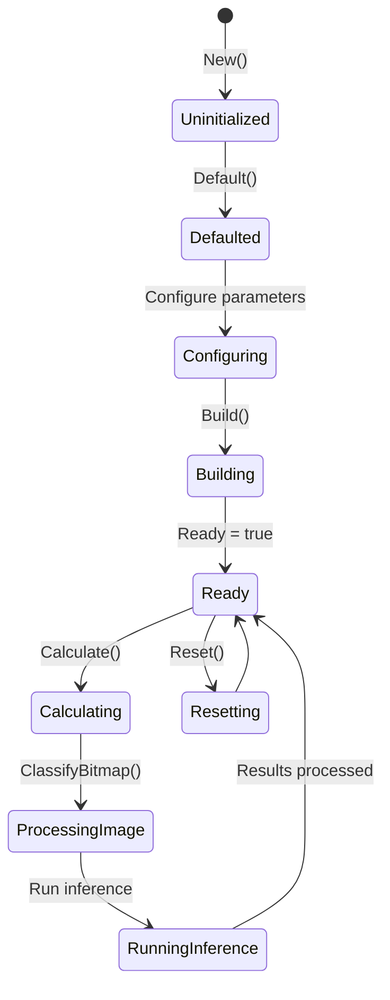
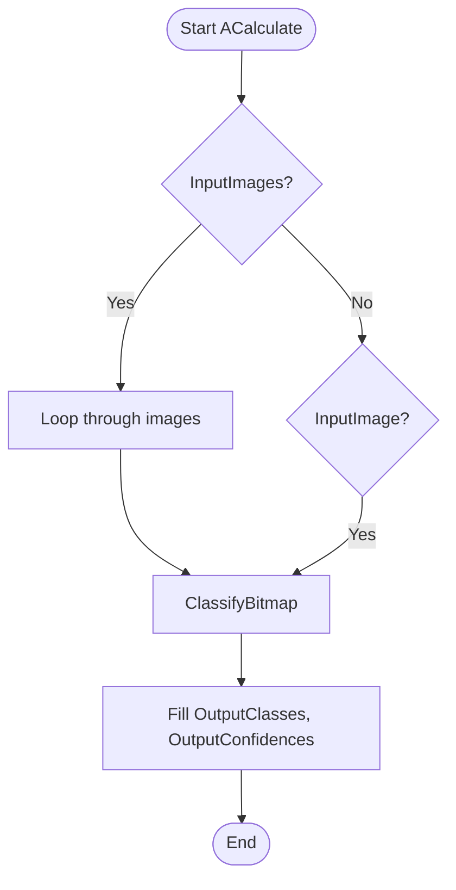

# UTfClassifier — классификатор TensorFlow

## RU

### Назначение

**Класс**: `UTfClassifier` (`ClassifierTF`) — классификатор изображений с использованием TensorFlow моделей.  
**Регистрация**: `Core/Lib.cpp` → `UploadClass("ClassifierTF", ...)`.  
**Storage-инстансы**: `ClassName = "ClassifierTF"` в `Bin/Configs/*/Model_*.xml`.

`UTfClassifier` реализует классификацию изображений с использованием предобученных TensorFlow моделей. Компонент загружает замороженную модель (`.pb` файл), выполняет инференс на входных изображениях и возвращает метки классов с оценками уверенности.

### UML-диаграмма классов



**Иерархия наследования:**
- `UNet` — базовый класс сетей компонентов
- `UClassifierBase` — базовый класс классификаторов (виртуальное наследование)
- `UTfComponent` — базовый компонент TensorFlow (виртуальное наследование)
- `UTfClassifier` — классификатор TensorFlow (множественное наследование)

**Ключевые свойства:**
- Параметры классификации: `ConfidenceThreshold`, `NumClasses`
- Входы: `InputImage`, `InputImages`
- Выходы: `OutputClasses`, `OutputConfidences`
- Состояние: `ClassificationTime`, `SaveDebugResults`

### UML-диаграмма последовательности



**Жизненный цикл:**
1. **Инициализация**: Установка параметров по умолчанию через `ADefault()` и `ATfDefault()`
2. **Настройка**: Установка пути к модели, количества классов, порога уверенности
3. **Сборка**: Загрузка модели, инициализация сессии через `ABuild()` и `ATfBuild()`
4. **Сброс**: Подготовка к вычислениям через `AReset()` и `ATfReset()`
5. **Вычисления**: Классификация изображений через `ACalculate()` и `ClassifyBitmap()`

### UML-диаграмма состояний



**Состояния:**
- **Uninitialized** — создан, но не инициализирован
- **Defaulted** — параметры установлены по умолчанию
- **Configuring** — настройка параметров модели и классификации
- **Building** — выполняется сборка компонента
- **LoadingModel** — загрузка TensorFlow модели
- **Built** — структура компонента построена
- **Ready** — готов к выполнению классификации
- **Calculating** — выполняется расчет компонента
- **ProcessingImage** — обработка входного изображения
- **RunningInference** — выполнение инференса TensorFlow
- **ProcessingResults** — обработка результатов классификации
- **SavingResults** — сохранение результатов (если включено)
- **Resetting** — выполняется сброс состояний
- **Error** — ошибка при выполнении операции

### UML-диаграмма активности



**Алгоритм классификации (ClassifyBitmap):**

```mermaid
flowchart TD
    Start([Start ClassifyBitmap]) --> CheckBuildDone{BuildDone?}
    CheckBuildDone -->|Нет| ReturnFalse([Return false])
    CheckBuildDone -->|Да| StartTimer[Начать отсчет времени]
    StartTimer --> SetInput[SetInputDataCvMeth<br/>преобразование UBitmap в тензор]
    SetInput --> CheckSetInput{Успешно?}
    CheckSetInput -->|Нет| SetDebugString1[Установить DebugString]
    SetDebugString1 --> ReturnFalse
    CheckSetInput -->|Да| RunInference[Run<br/>выполнение инференса]
    RunInference --> CheckRun{Успешно?}
    CheckRun -->|Нет| SetDebugString2[Установить DebugString]
    SetDebugString2 --> ReturnFalse
    CheckRun -->|Да| ExtractResults[Извлечь результаты<br/>из выходного тензора]
    ExtractResults --> CheckNumClasses{result.size()<br/>== NumClasses?}
    CheckNumClasses -->|Нет| SetDebugString3[Установить DebugString<br/>"Number of classes is wrong"]
    SetDebugString3 --> ReturnFalse
    CheckNumClasses -->|Да| FindMax[Найти максимальный<br/>класс и уверенность]
    FindMax --> CheckThreshold{max_conf<br/>>= conf_thresh?}
    CheckThreshold -->|Да| SetClassified[is_classified = true]
    CheckThreshold -->|Нет| SetNotClassified[is_classified = false]
    SetClassified --> StopTimer[Остановить отсчет времени]
    SetNotClassified --> StopTimer
    StopTimer --> CheckSaveDebug{SaveDebugResults?}
    CheckSaveDebug -->|Да| CreateDir[Создать директорию<br/>classification_results]
    CreateDir --> SaveImage[Сохранить изображение<br/>с метаданными]
    SaveImage --> ReturnTrue([Return true])
    CheckSaveDebug -->|Нет| ReturnTrue
```

### UML-диаграмма компонентов



**Зависимости:**
- **Базовые классы**: `UClassifierBase`, `UTfComponent`, `UNet`
- **Внутренний компонент**: `TfClassifier` (TTfSession)
- **Внешние библиотеки**: TensorFlow C API, OpenCV
- **Входы**: `InputImage` (UBitmap), `InputImages` (vector<UBitmap>)
- **Выходы**: `OutputClasses` (MDMatrix<int>), `OutputConfidences` (MDMatrix<double>)

### Свойства

#### Параметры (ptPubParameter)

**От UClassifierBase:**
- **`ConfidenceThreshold`** (double) — порог уверенности для классификации. Если максимальная уверенность меньше порога, класс помечается как `CLASS_LOWQUAL`. Значение по умолчанию: `0.5`

- **`NumClasses`** (int) — количество классов, которые может распознать модель. Должно соответствовать количеству выходных значений модели. Значение по умолчанию: `0`

**От UTfComponent:**
- **`PbModelPath`** (string) — путь к файлу замороженной модели TensorFlow (`.pb` файл). Значение по умолчанию: `""`

- **`InputNodeName`** (string) — имя входного узла графа TensorFlow. Значение по умолчанию: `""`

- **`OutputNodeName`** (vector<string>) — вектор имен выходных узлов графа TensorFlow. Обычно содержит один элемент с именем выходного узла классификатора. Значение по умолчанию: `{""}`

- **`ImgDiv`** (float) — делитель для нормализации входного изображения. Значение по умолчанию: `255.0`

- **`ImgSub`** (vector<float>) — вектор значений для вычитания из нормализованного изображения. Значение по умолчанию: `{0.0, 0.0, 0.0}`

- **`UseBGR`** (bool) — флаг использования формата BGR вместо RGB. Значение по умолчанию: `false`

- **`GpuFraction`** (double) — доля памяти GPU для использования. Значение по умолчанию: `0.8`

**От UTfClassifier:**
- **`SaveDebugResults`** (bool) — флаг сохранения результатов классификации для отладки. Если `true`, изображения сохраняются в директорию `classification_results/<class_id>/` с метаданными (класс, уверенность). Значение по умолчанию: `false`

#### Входы (ptPubInput)

**От UClassifierBase:**
- **`InputImage`** (UBitmap) — входное изображение для классификации. Используется, если `InputImages` не подключен.

- **`InputImages`** (vector<UBitmap>) — вектор входных изображений для пакетной классификации. Если подключен, используется вместо `InputImage`.

#### Выходы (ptPubOutput)

**От UClassifierBase:**
- **`OutputClasses`** (MDMatrix<int>) — матрица идентификаторов классов для каждого входного изображения. Размер: `[num_images, 1]`. Значения:
  - Положительное число — идентификатор класса
  - `CLASS_UNDEFINED` (-2) — классификация не выполнена
  - `CLASS_LOWQUAL` (-3) — уверенность ниже порога

- **`OutputConfidences`** (MDMatrix<double>) — матрица оценок уверенности для каждого класса и каждого входного изображения. Размер: `[num_images, NumClasses]`. Каждая строка содержит оценки уверенности для всех классов.

#### Состояния (ptPubState)

**От UClassifierBase:**
- **`ClassificationTime`** (double) — время выполнения последней классификации в секундах. Измеряется от начала обработки изображения до получения результатов.

**От UTfComponent:**
- **`DebugString`** (string) — строка с информацией об ошибках или текущем состоянии компонента.

- **`ExpectedHeight`** (int) — ожидаемая высота входного изображения (в пикселях).

- **`ExpectedWidth`** (int) — ожидаемая ширина входного изображения (в пикселях).

- **`ExpectedChannels`** (int) — ожидаемое количество каналов входного изображения.

### Методы

#### Публичные методы

- **`New()`** → `UTfClassifier*` — создает новый экземпляр класса.

- **`SetNumClasses(const int &value)`** → `bool` — устанавливает количество классов. Устанавливает `Ready = false`, требует пересборки компонента.

#### Защищенные методы жизненного цикла

- **`ATfDefault()`** → `bool` — инициализирует специфичные параметры по умолчанию. Устанавливает `NumClasses = 0`.

- **`ATfBuild()`** → `bool` — выполняет дополнительную инициализацию при сборке. В текущей реализации просто возвращает `true`.

- **`ATfReset()`** → `bool` — сбрасывает специфичные состояния. Устанавливает:
  - `ClassificationTime = 0.0`
  - `OutputClasses->Resize(0, 1)`
  - `OutputConfidences->Resize(0, NumClasses)`

- **`ClassifyBitmap(UBitmap &bmp, MDVector<double> &output_confidences, double conf_thresh, int &class_id, bool &is_classified)`** → `bool` — выполняет классификацию одного изображения.

  **Параметры:**
  - `bmp` — входное изображение для классификации
  - `output_confidences` — выходной вектор оценок уверенности (заполняется методом)
  - `conf_thresh` — порог уверенности для классификации
  - `class_id` — выходной идентификатор класса (заполняется методом)
  - `is_classified` — выходной флаг успешной классификации (заполняется методом)

  **Возвращает:** `true` при успешной классификации, `false` при ошибке.

  **Алгоритм:**
  1. Проверка `BuildDone`
  2. Преобразование изображения в тензор через `TfObject->SetInputDataCvMeth()`
  3. Выполнение инференса через `TfObject->Run()`
  4. Извлечение результатов из выходного тензора
  5. Поиск класса с максимальной уверенностью
  6. Проверка порога уверенности
  7. Сохранение результатов (если `SaveDebugResults == true`)

### Примеры использования

#### Пример 1: Создание классификатора в коде C++

```cpp
// Создание классификатора
auto classifier = storage->CreateComponent<UTfClassifier>();
classifier->SetName("ImageClassifier");

// Инициализация
classifier->Default();

// Настройка параметров модели
classifier->PbModelPath = "models/inception_v3.pb";
classifier->InputNodeName = "input";
classifier->OutputNodeName = {"InceptionV3/Predictions/Reshape_1"};
classifier->NumClasses = 1000;

// Настройка параметров нормализации (ImageNet)
classifier->ImgDiv = 255.0;
classifier->ImgSub = {0.485, 0.456, 0.406};
classifier->UseBGR = false;

// Настройка классификации
classifier->ConfidenceThreshold = 0.5;
classifier->SaveDebugResults = false;

// Настройка GPU
classifier->GpuFraction = 0.8;

// Сборка
classifier->Build();

// Проверка готовности
if (!classifier->IsReady()) {
    std::cerr << "Error: " << classifier->DebugString << std::endl;
    return;
}

// Классификация одного изображения
UBitmap inputImage;
// ... загрузка изображения ...
classifier->InputImage = inputImage;
classifier->Calculate();

// Получение результатов
int classId = classifier->OutputClasses(0, 0);
double maxConfidence = 0.0;
for (int i = 0; i < classifier->NumClasses; i++) {
    double conf = classifier->OutputConfidences(0, i);
    if (conf > maxConfidence) {
        maxConfidence = conf;
    }
}

std::cout << "Class: " << classId << ", Confidence: " << maxConfidence << std::endl;
std::cout << "Classification time: " << classifier->ClassificationTime << "s" << std::endl;
```

#### Пример 2: Пакетная классификация

```cpp
// Настройка компонента (как в примере 1)
// ...

// Пакетная классификация
std::vector<UBitmap> images;
// ... загрузка изображений ...
classifier->InputImages = images;
classifier->Calculate();

// Получение результатов для всех изображений
for (int i = 0; i < images.size(); i++) {
    int classId = classifier->OutputClasses(i, 0);
    std::cout << "Image " << i << ": Class " << classId << std::endl;
}
```

#### Пример 3: Конфигурация XML

```xml
<ImageClassifier Class="ClassifierTF">
    <Parameters>
        <PbModelPath>models/inception_v3.pb</PbModelPath>
        <InputNodeName>input</InputNodeName>
        <OutputNodeName>
            <elem>InceptionV3/Predictions/Reshape_1</elem>
        </OutputNodeName>
        <NumClasses>1000</NumClasses>
        <ConfidenceThreshold>0.5</ConfidenceThreshold>
        <ImgDiv>255.0</ImgDiv>
        <ImgSub>
            <elem>0.485</elem>
            <elem>0.456</elem>
            <elem>0.406</elem>
        </ImgSub>
        <UseBGR>false</UseBGR>
        <GpuFraction>0.8</GpuFraction>
        <SaveDebugResults>false</SaveDebugResults>
    </Parameters>
</ImageClassifier>
```

### Использование в конфигурациях

`UTfClassifier` используется для классификации изображений в различных сценариях:

- **Классификация объектов** — распознавание объектов на изображениях
- **Распознавание сцен** — классификация типов сцен
- **Распознавание лиц** — идентификация лиц
- **Медицинская диагностика** — классификация медицинских изображений

**Типичные значения параметров:**
- **PbModelPath**: `"models/inception_v3.pb"`, `"models/resnet50.pb"`, `"models/mobilenet_v2.pb"`
- **InputNodeName**: `"input"`, `"Placeholder"`, `"image_tensor"`
- **OutputNodeName**: `{"InceptionV3/Predictions/Reshape_1"}`, `{"output"}`, `{"predictions"}`
- **NumClasses**: `1000` (ImageNet), `10` (CIFAR-10), `100` (CIFAR-100)
- **ConfidenceThreshold**: `0.5` (стандартный), `0.7` (высокая уверенность), `0.3` (низкая уверенность)
- **ImgDiv**: `255.0` (для uint8 изображений)
- **ImgSub**: `{0.485, 0.456, 0.406}` (ImageNet нормализация), `{0.0, 0.0, 0.0}` (без центрирования)
- **UseBGR**: `false` (для большинства моделей)
- **GpuFraction**: `0.8` (80% памяти GPU)
- **SaveDebugResults**: `false` (в продакшене), `true` (для отладки)

### См. также

- [`UTfComponent`](UTfComponent.md) — базовый компонент TensorFlow
- [`UTfDetector`](UTfDetector.md) — детектор объектов TensorFlow
- [`UTfSqDetector`](UTfSqDetector.md) — детектор SqueezeDet TensorFlow
- [`UClassifierBase`](../../Rdk-CvBasicLib/Docs/Components/DetectorsSegmentators.md) — базовый класс классификаторов
- [Architecture.md](../Architecture.md) — архитектура библиотеки
- [Usage-Examples.md](../Usage-Examples.md) — примеры использования

---

## EN

### Purpose

**Class**: `UTfClassifier` (`ClassifierTF`) — image classifier using TensorFlow models.  
**Registration**: `Core/Lib.cpp` → `UploadClass("ClassifierTF", ...)`.  
**Instances**: `ClassName = "ClassifierTF"` in `Bin/Configs/*/Model_*.xml`.

`UTfClassifier` implements image classification using pre-trained TensorFlow models. The component loads a frozen model (`.pb` file), performs inference on input images, and returns class labels with confidence scores.

### UML Class Diagram



### UML Sequence Diagram



### UML State Diagram



### UML Activity Diagram



### Properties

- `ConfidenceThreshold` — confidence threshold for classification
- `NumClasses` — number of classes the model can recognize
- `InputImage` — input image for classification
- `InputImages` — vector of input images for batch classification
- `OutputClasses` — matrix of class IDs for each input image
- `OutputConfidences` — matrix of confidence scores for each class and image
- `ClassificationTime` — time taken for last classification
- `SaveDebugResults` — flag to save classification results for debugging
- `PbModelPath` — path to frozen TensorFlow model file
- `InputNodeName` — name of input node in TensorFlow graph
- `OutputNodeName` — vector of output node names

### Methods

- `New()` — create new instance
- `SetNumClasses(value)` — set number of classes
- `ATfDefault()` — initialize default parameters
- `ATfBuild()` — perform additional initialization
- `ATfReset()` — reset component state
- `ClassifyBitmap(bmp, confidences, thresh, class_id, is_classified)` — classify single image

### Usage Examples

```cpp
auto classifier = storage->CreateComponent<UTfClassifier>();
classifier->Default();
classifier->PbModelPath = "models/inception_v3.pb";
classifier->InputNodeName = "input";
classifier->OutputNodeName = {"output"};
classifier->NumClasses = 1000;
classifier->Build();

classifier->InputImage = inputImage;
classifier->Calculate();
int classId = classifier->OutputClasses(0, 0);
```

### See Also

- [`UTfComponent`](UTfComponent.md) — base TensorFlow component
- [`UTfDetector`](UTfDetector.md) — TensorFlow detector
- [`UTfSqDetector`](UTfSqDetector.md) — TensorFlow SqueezeDet detector
- [Architecture.md](../Architecture.md) — library architecture
