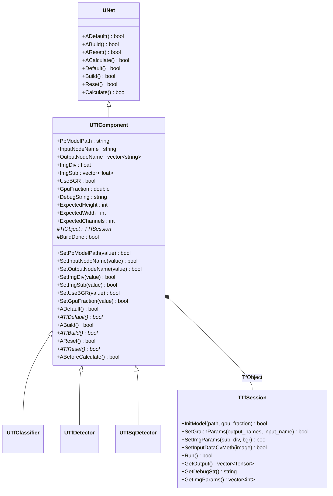
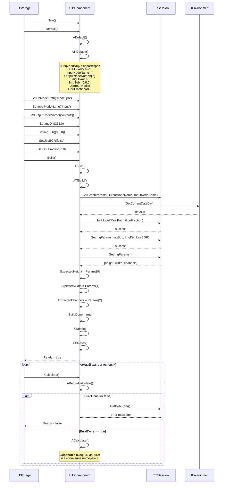
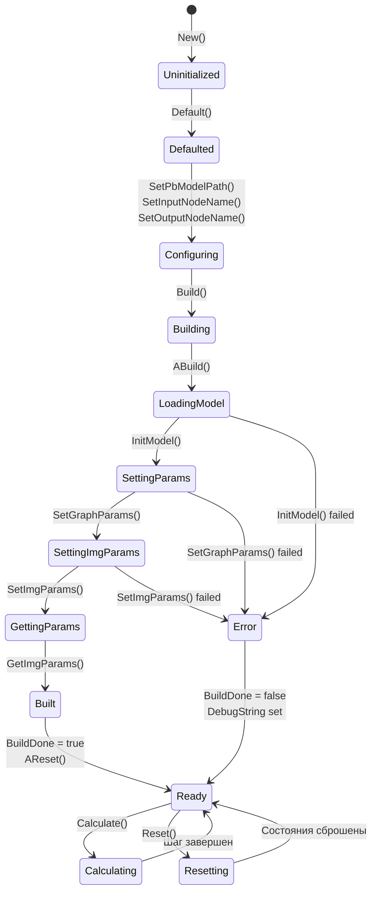
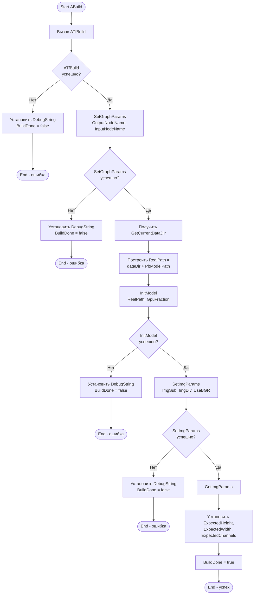
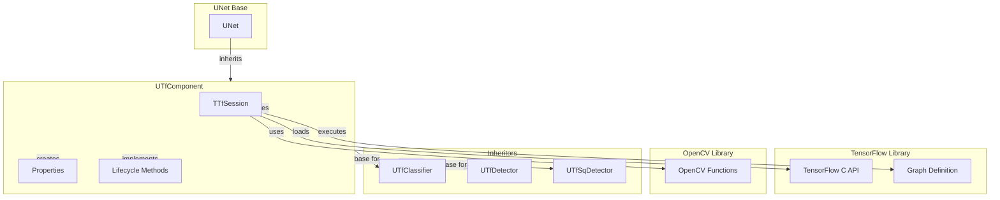
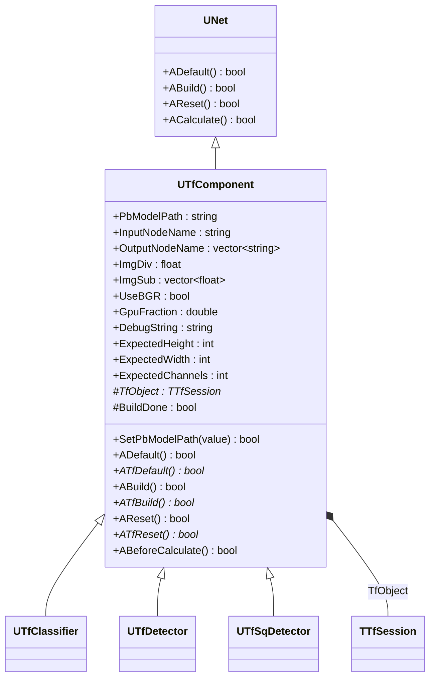
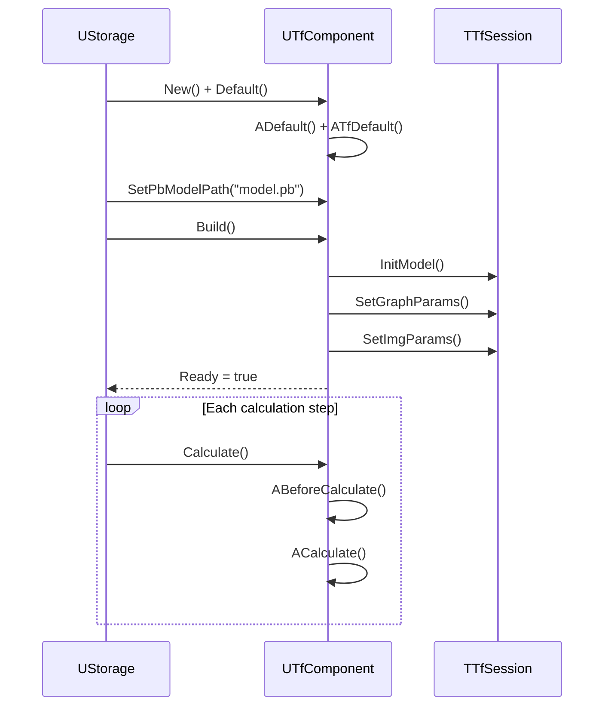
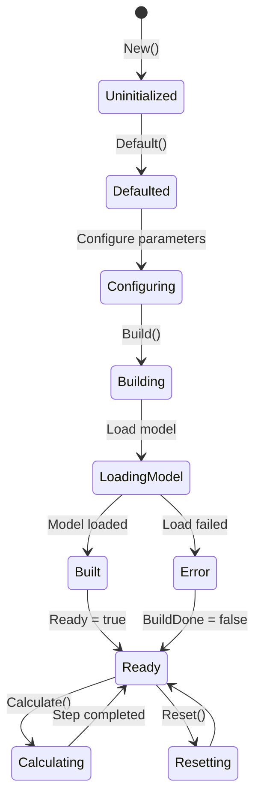
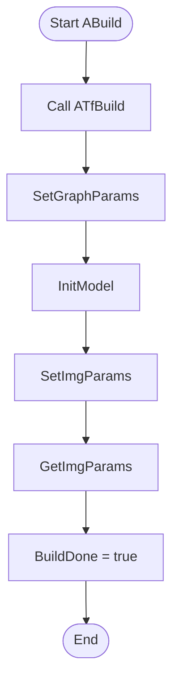
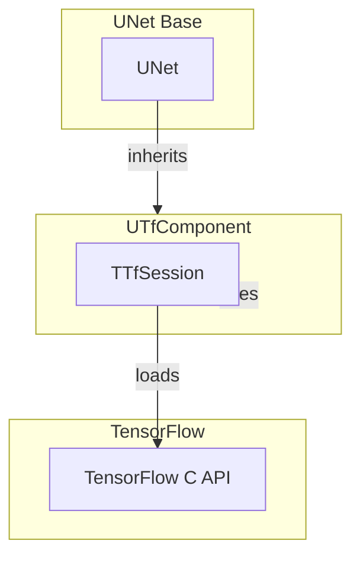

# UTfComponent — базовый компонент TensorFlow

## RU

### Назначение

**Класс**: `UTfComponent` — базовый абстрактный компонент для работы с TensorFlow моделями.  
**Регистрация**: Не регистрируется напрямую, используется как базовый класс для `UTfClassifier`, `UTfDetector`, `UTfSqDetector`.  
**Storage-инстансы**: Не создается напрямую, используется через наследников.

`UTfComponent` предоставляет общую функциональность для всех TensorFlow компонентов: загрузку моделей, настройку параметров нормализации изображений, управление TensorFlow сессией, обработку входных данных и выполнение инференса.

### UML-диаграмма классов



**Иерархия наследования:**
- `UNet` — базовый класс сетей компонентов
- `UTfComponent` — базовый компонент TensorFlow (абстрактный)
- `UTfClassifier`, `UTfDetector`, `UTfSqDetector` — конкретные реализации

**Ключевые свойства:**
- Параметры модели: `PbModelPath`, `InputNodeName`, `OutputNodeName`
- Параметры нормализации: `ImgDiv`, `ImgSub`, `UseBGR`
- Параметры GPU: `GpuFraction`
- Состояние: `DebugString`, `ExpectedHeight`, `ExpectedWidth`, `ExpectedChannels`, `BuildDone`

### UML-диаграмма последовательности



**Жизненный цикл:**
1. **Инициализация**: Установка параметров по умолчанию через `ADefault()` и `ATfDefault()`
2. **Настройка**: Установка пути к модели, имен узлов, параметров нормализации
3. **Сборка**: Загрузка модели, инициализация сессии через `ABuild()` и `ATfBuild()`
4. **Сброс**: Подготовка к вычислениям через `AReset()` и `ATfReset()`
5. **Вычисления**: Обработка данных через `ACalculate()` и `ABeforeCalculate()`

### UML-диаграмма состояний



**Состояния:**
- **Uninitialized** — создан, но не инициализирован
- **Defaulted** — параметры установлены по умолчанию
- **Configuring** — настройка параметров модели
- **Building** — выполняется сборка компонента
- **LoadingModel** — загрузка TensorFlow модели
- **SettingParams** — установка параметров графа
- **SettingImgParams** — установка параметров нормализации изображений
- **GettingParams** — получение параметров изображения из модели
- **Built** — структура компонента построена
- **Ready** — готов к выполнению расчетов
- **Calculating** — выполняется расчет компонента
- **Resetting** — выполняется сброс состояний
- **Error** — ошибка при сборке

### UML-диаграмма активности



**Алгоритм сборки:**
1. Вызов виртуального метода `ATfBuild()` (реализуется в наследниках)
2. Установка параметров графа (имена входных и выходных узлов)
3. Получение пути к директории данных
4. Загрузка модели TensorFlow
5. Установка параметров нормализации изображений
6. Получение параметров изображения из модели
7. Установка флага `BuildDone = true`

### UML-диаграмма компонентов



**Зависимости:**
- **Базовый класс**: `UNet`
- **Внутренний компонент**: `TTfSession` (TensorFlow сессия)
- **Внешние библиотеки**: TensorFlow C API, OpenCV
- **Наследники**: `UTfClassifier`, `UTfDetector`, `UTfSqDetector`

### Свойства

#### Параметры (ptPubParameter)

- **`PbModelPath`** (string) — путь к файлу замороженной модели TensorFlow (`.pb` файл). Путь может быть относительным (относительно `GetCurrentDataDir()`) или абсолютным. Значение по умолчанию: `""`

- **`InputNodeName`** (string) — имя входного узла графа TensorFlow. Должно соответствовать имени входного узла в загруженной модели. Значение по умолчанию: `""`

- **`OutputNodeName`** (vector<string>) — вектор имен выходных узлов графа TensorFlow. Может содержать несколько выходных узлов. Значение по умолчанию: `{""}`

- **`ImgDiv`** (float) — делитель для нормализации входного изображения. Используется для приведения значений пикселей к диапазону [0, 1]. Формула: `normalized = (pixel / ImgDiv) - ImgSub`. Значение по умолчанию: `255.0`

- **`ImgSub`** (vector<float>) — вектор значений для вычитания из нормализованного изображения (по каналам). Обычно используется для центрирования данных. Размер вектора должен соответствовать количеству каналов (обычно 3 для RGB/BGR). Значение по умолчанию: `{0.0, 0.0, 0.0}`

- **`UseBGR`** (bool) — флаг использования формата BGR вместо RGB. Если `true`, каналы изображения будут переставлены из RGB в BGR перед обработкой. Значение по умолчанию: `false`

- **`GpuFraction`** (double) — доля памяти GPU, которую можно использовать для TensorFlow сессии. Значение от 0.0 до 1.0. Значение по умолчанию: `0.8`

#### Состояния (ptPubState)

- **`DebugString`** (string) — строка с информацией об ошибках или текущем состоянии компонента. Заполняется при ошибках в методах `ABuild()`, `ABeforeCalculate()`. Значение по умолчанию: `""`

- **`ExpectedHeight`** (int) — ожидаемая высота входного изображения (в пикселях). Устанавливается автоматически после загрузки модели на основе параметров графа. Значение по умолчанию: `-1`

- **`ExpectedWidth`** (int) — ожидаемая ширина входного изображения (в пикселях). Устанавливается автоматически после загрузки модели на основе параметров графа. Значение по умолчанию: `-1`

- **`ExpectedChannels`** (int) — ожидаемое количество каналов входного изображения. Устанавливается автоматически после загрузки модели на основе параметров графа. Значение по умолчанию: `0`

#### Защищенные свойства

- **`TfObject`** (TTfSession*) — указатель на объект TensorFlow сессии. Инициализируется в конструкторах наследников.

- **`BuildDone`** (bool) — флаг успешной сборки компонента. Устанавливается в `true` после успешной загрузки модели и инициализации сессии. Используется для проверки готовности компонента к вычислениям.

### Методы

#### Публичные методы установки параметров

- **`SetPbModelPath(const std::string &value)`** → `bool` — устанавливает путь к модели TensorFlow. Устанавливает `Ready = false`, требует пересборки компонента.

- **`SetInputNodeName(const std::string &value)`** → `bool` — устанавливает имя входного узла графа. Устанавливает `Ready = false`, требует пересборки компонента.

- **`SetOutputNodeName(const std::vector<std::string> &value)`** → `bool` — устанавливает вектор имен выходных узлов графа. Устанавливает `Ready = false`, требует пересборки компонента.

- **`SetImgDiv(const float &value)`** → `bool` — устанавливает делитель для нормализации изображения. Устанавливает `Ready = false`, требует пересборки компонента.

- **`SetImgSub(const std::vector<float> &value)`** → `bool` — устанавливает вектор значений для вычитания при нормализации. Устанавливает `Ready = false`, требует пересборки компонента.

- **`SetUseBGR(const bool &value)`** → `bool` — устанавливает флаг использования формата BGR. Устанавливает `Ready = false`, требует пересборки компонента.

- **`SetGpuFraction(const double &value)`** → `bool` — устанавливает долю памяти GPU. Устанавливает `Ready = false`, требует пересборки компонента.

#### Защищенные методы жизненного цикла

- **`ADefault()`** → `bool` — инициализирует параметры по умолчанию. Устанавливает:
  - `PbModelPath = ""`
  - `InputNodeName = ""`
  - `OutputNodeName = {""}`
  - `ImgDiv = 255.0`
  - `ImgSub = {0.0, 0.0, 0.0}`
  - `UseBGR = false`
  - `GpuFraction = 0.8`
  Затем вызывает виртуальный метод `ATfDefault()`.

- **`ATfDefault()`** → `bool` — виртуальный метод для инициализации специфичных параметров в наследниках. Должен быть реализован в каждом наследнике.

- **`ABuild()`** → `bool` — строит структуру компонента. Выполняет:
  1. Вызывает `ATfBuild()` (виртуальный метод наследника)
  2. Устанавливает параметры графа через `TfObject->SetGraphParams()`
  3. Загружает модель через `TfObject->InitModel()`
  4. Устанавливает параметры нормализации через `TfObject->SetImgParams()`
  5. Получает параметры изображения через `TfObject->GetImgParams()`
  6. Устанавливает `BuildDone = true` при успехе

- **`ATfBuild()`** → `bool` — виртуальный метод для дополнительной инициализации в наследниках. Должен быть реализован в каждом наследнике.

- **`AReset()`** → `bool` — сбрасывает состояние компонента. Вызывает виртуальный метод `ATfReset()`.

- **`ATfReset()`** → `bool` — виртуальный метод для сброса специфичных состояний в наследниках. Должен быть реализован в каждом наследнике.

- **`ABeforeCalculate()`** → `bool` — вызывается перед каждым вычислением. Проверяет `BuildDone`, если `false`, устанавливает `Ready = false` и записывает сообщение об ошибке в `DebugString`.

### Примеры использования

#### Пример 1: Создание компонента в коде C++

```cpp
// UTfComponent - абстрактный класс, используется через наследников
// Пример с UTfClassifier:
auto classifier = storage->CreateComponent<UTfClassifier>();
classifier->SetName("MyClassifier");

// Инициализация
classifier->Default();

// Настройка параметров модели
classifier->PbModelPath = "models/classifier.pb";
classifier->InputNodeName = "input";
classifier->OutputNodeName = {"output"};

// Настройка параметров нормализации
classifier->ImgDiv = 255.0;
classifier->ImgSub = {0.485, 0.456, 0.406};  // ImageNet нормализация
classifier->UseBGR = false;

// Настройка GPU
classifier->GpuFraction = 0.8;

// Сборка
classifier->Build();

// Проверка готовности
if (classifier->IsReady()) {
    std::cout << "Model loaded successfully" << std::endl;
    std::cout << "Expected size: " << classifier->ExpectedWidth 
              << "x" << classifier->ExpectedHeight 
              << "x" << classifier->ExpectedChannels << std::endl;
} else {
    std::cout << "Error: " << classifier->DebugString << std::endl;
}
```

#### Пример 2: Конфигурация XML

```xml
<Classifier1 Class="ClassifierTF">
    <Parameters>
        <PbModelPath>models/inception_v3.pb</PbModelPath>
        <InputNodeName>input</InputNodeName>
        <OutputNodeName>
            <elem>output</elem>
        </OutputNodeName>
        <ImgDiv>255.0</ImgDiv>
        <ImgSub>
            <elem>0.485</elem>
            <elem>0.456</elem>
            <elem>0.406</elem>
        </ImgSub>
        <UseBGR>false</UseBGR>
        <GpuFraction>0.8</GpuFraction>
    </Parameters>
</Classifier1>
```

### Использование в конфигурациях

`UTfComponent` используется как базовый класс для всех TensorFlow компонентов:

- **UTfClassifier** — классификация изображений
- **UTfDetector** — детекция объектов
- **UTfSqDetector** — детекция объектов (SqueezeDet)

**Типичные значения параметров:**
- **PbModelPath**: `"models/classifier.pb"`, `"models/detector.pb"` (относительно `GetCurrentDataDir()`)
- **InputNodeName**: `"input"`, `"Placeholder"`, `"image_tensor"` (зависит от модели)
- **OutputNodeName**: `{"output"}`, `{"predictions"}`, `{"detection_boxes", "detection_scores", "detection_classes"}` (зависит от модели)
- **ImgDiv**: `255.0` (для uint8 изображений), `1.0` (для float изображений)
- **ImgSub**: `{0.0, 0.0, 0.0}` (без центрирования), `{0.485, 0.456, 0.406}` (ImageNet нормализация)
- **UseBGR**: `false` (для большинства моделей), `true` (для моделей, обученных на BGR данных)
- **GpuFraction**: `0.8` (80% памяти GPU), `0.5` (50% памяти GPU), `1.0` (вся доступная память)

### См. также

- [`UTfClassifier`](UTfClassifier.md) — классификатор TensorFlow
- [`UTfDetector`](UTfDetector.md) — детектор объектов TensorFlow
- [`UTfSqDetector`](UTfSqDetector.md) — детектор SqueezeDet TensorFlow
- [`UClassifierBase`](../../Rdk-CvBasicLib/Docs/Components/DetectorsSegmentators.md) — базовый класс классификаторов
- [`UDetectorBase`](../../Rdk-CvBasicLib/Docs/Components/DetectorsSegmentators.md) — базовый класс детекторов
- [Architecture.md](../Architecture.md) — архитектура библиотеки

---

## EN

### Purpose

**Class**: `UTfComponent` — base abstract component for working with TensorFlow models.  
**Registration**: Not registered directly, used as base class for `UTfClassifier`, `UTfDetector`, `UTfSqDetector`.  
**Instances**: Not created directly, used through inheritors.

`UTfComponent` provides common functionality for all TensorFlow components: model loading, image normalization parameters setup, TensorFlow session management, input data processing, and inference execution.

### UML Class Diagram



### UML Sequence Diagram



### UML State Diagram



### UML Activity Diagram



### UML Component Diagram



### Properties

- `PbModelPath` — path to frozen TensorFlow model file (.pb)
- `InputNodeName` — name of input node in TensorFlow graph
- `OutputNodeName` — vector of output node names
- `ImgDiv` — divisor for image normalization
- `ImgSub` — vector of values to subtract from normalized image
- `UseBGR` — flag to use BGR format instead of RGB
- `GpuFraction` — fraction of GPU memory to use
- `DebugString` — error message or debug information
- `ExpectedHeight`, `ExpectedWidth`, `ExpectedChannels` — expected image dimensions from model

### Methods

- `SetPbModelPath(value)` — set path to model file
- `SetInputNodeName(value)` — set input node name
- `SetOutputNodeName(value)` — set output node names
- `SetImgDiv(value)` — set image normalization divisor
- `SetImgSub(value)` — set image normalization subtract values
- `SetUseBGR(value)` — set BGR format flag
- `SetGpuFraction(value)` — set GPU memory fraction
- `ADefault()` — initialize default parameters
- `ATfDefault()` — virtual method for inheritor-specific initialization
- `ABuild()` — build component structure (load model, initialize session)
- `ATfBuild()` — virtual method for inheritor-specific build
- `AReset()` — reset component state
- `ATfReset()` — virtual method for inheritor-specific reset
- `ABeforeCalculate()` — called before each calculation step

### Usage Examples

```cpp
auto classifier = storage->CreateComponent<UTfClassifier>();
classifier->Default();
classifier->PbModelPath = "models/classifier.pb";
classifier->InputNodeName = "input";
classifier->OutputNodeName = {"output"};
classifier->Build();
```

### See Also

- [`UTfClassifier`](UTfClassifier.md) — TensorFlow classifier
- [`UTfDetector`](UTfDetector.md) — TensorFlow detector
- [`UTfSqDetector`](UTfSqDetector.md) — TensorFlow SqueezeDet detector
- [Architecture.md](../Architecture.md) — library architecture
