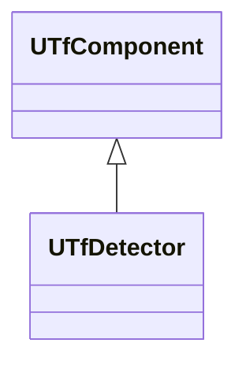
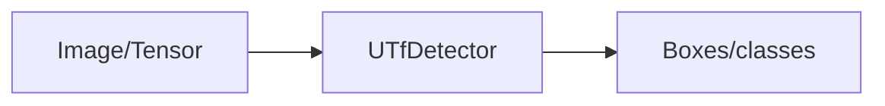
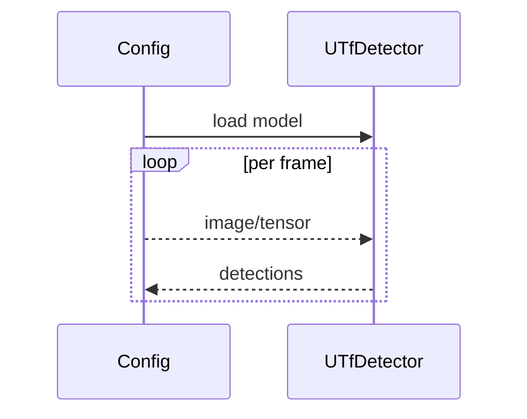

## UTfDetector — детектор TensorFlow

**Класс**: `UTfDetector` (`DetectorTF`) — детекция объектов с помощью TF модели.  
**Регистрация**: `Core/Lib.cpp` → `UploadClass("DetectorTF", ...)`.  
**Storage-инстансы**: `ClassName = "DetectorTF"`; параметры: модель, anchors, labels, NMS.

### Входы/выходы
- Вход: изображение/тензор.
- Выход: bounding boxes, классы, scores.

Пояснение: блок-схема показывает поток данных/сигналов (входы → компонент → выходы).

Пояснение: диаграмма последовательности показывает типовой сценарий взаимодействия и порядок вызовов.

---

## UTfDetector — TensorFlow detector

Runs TF detection graph and returns boxes/classes/scores.
