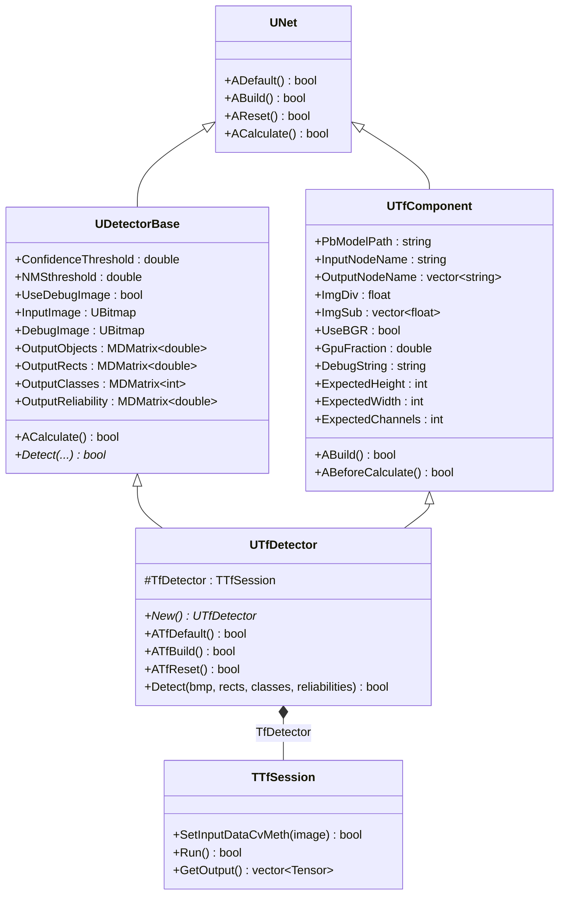
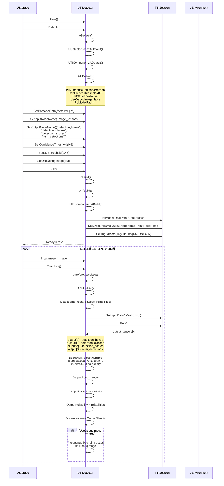
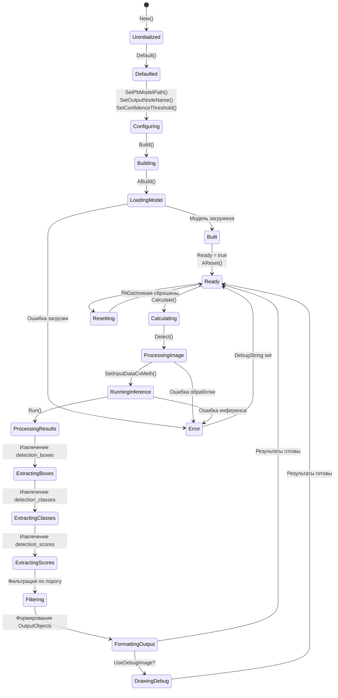
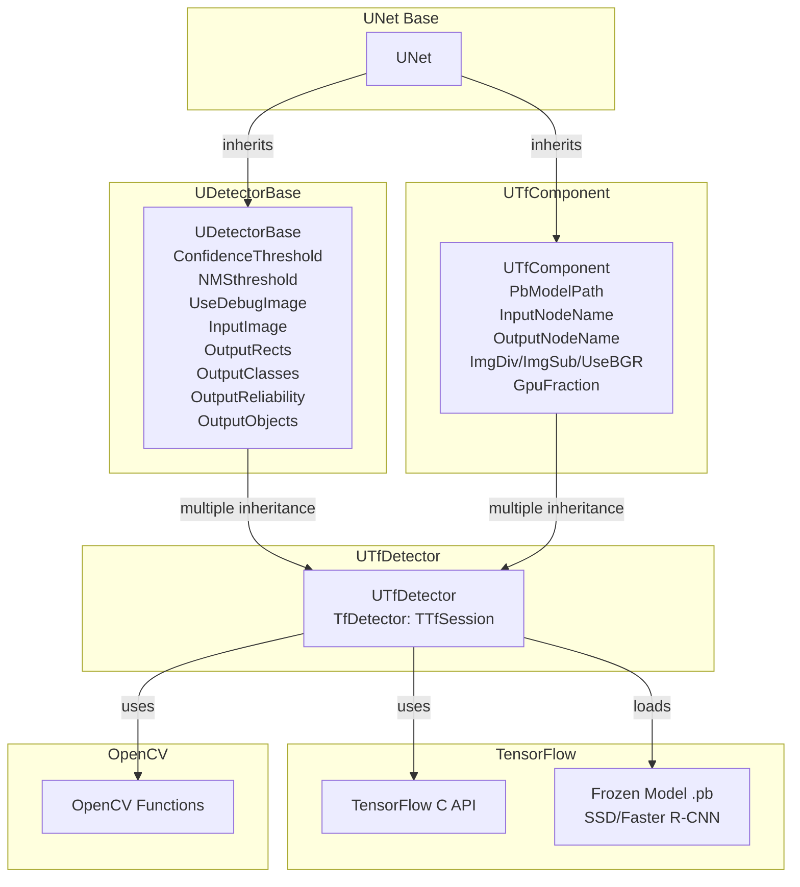
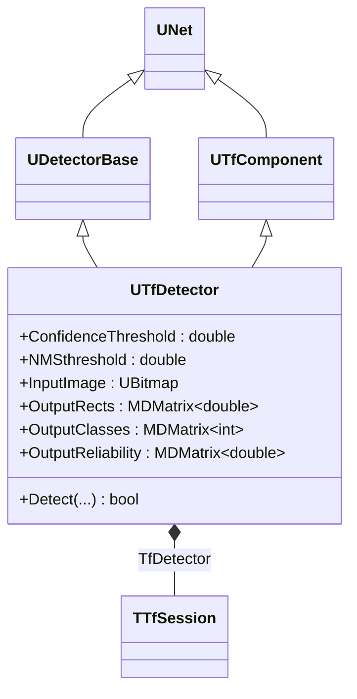
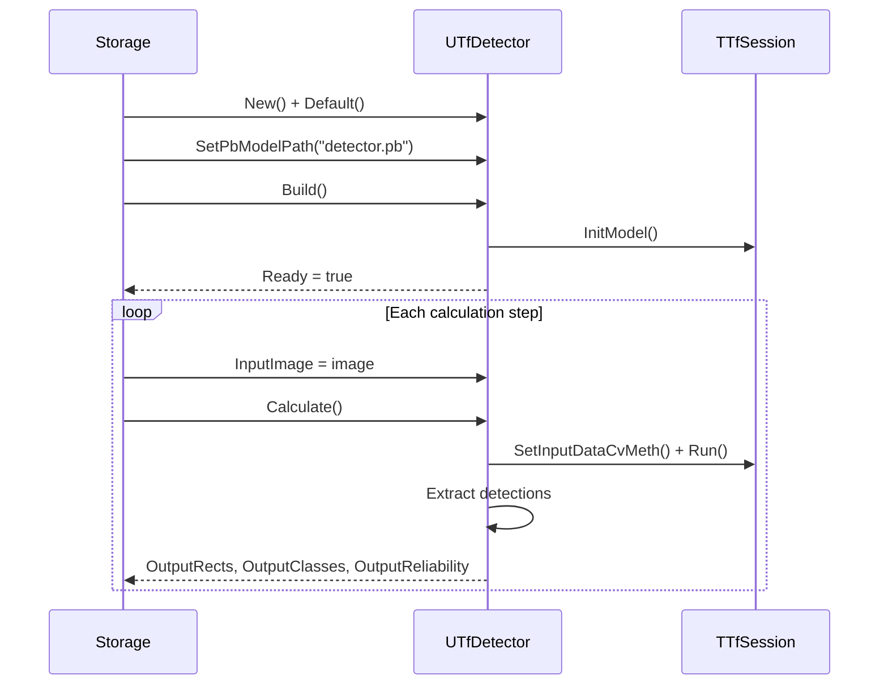
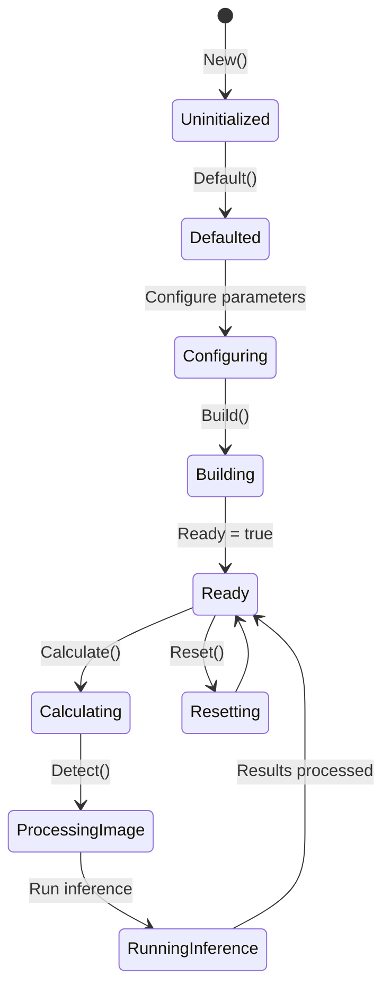

# UTfDetector — детектор объектов TensorFlow

## RU

### Назначение

**Класс**: `UTfDetector` (`DetectorTF`) — детектор объектов с использованием TensorFlow моделей.  
**Регистрация**: `Core/Lib.cpp` → `UploadClass("DetectorTF", ...)`.  
**Storage-инстансы**: `ClassName = "DetectorTF"` в `Bin/Configs/*/Model_*.xml`.

`UTfDetector` реализует детекцию объектов на изображениях с использованием предобученных TensorFlow моделей детекции (например, SSD, Faster R-CNN). Компонент загружает замороженную модель (`.pb` файл), выполняет инференс на входных изображениях и возвращает координаты ограничивающих прямоугольников (bounding boxes), классы объектов и оценки уверенности.

### UML-диаграмма классов



**Иерархия наследования:**
- `UNet` — базовый класс сетей компонентов
- `UDetectorBase` — базовый класс детекторов (виртуальное наследование)
- `UTfComponent` — базовый компонент TensorFlow (виртуальное наследование)
- `UTfDetector` — детектор объектов TensorFlow (множественное наследование)

**Ключевые свойства:**
- Параметры детекции: `ConfidenceThreshold`, `NMSthreshold`
- Входы: `InputImage`
- Выходы: `OutputRects`, `OutputClasses`, `OutputReliability`, `OutputObjects`
- Отладка: `UseDebugImage`, `DebugImage`

### UML-диаграмма последовательности



**Жизненный цикл:**
1. **Инициализация**: Установка параметров по умолчанию через `ADefault()` и `ATfDefault()`
2. **Настройка**: Установка пути к модели, имен узлов, порогов детекции
3. **Сборка**: Загрузка модели, инициализация сессии через `ABuild()` и `ATfBuild()`
4. **Сброс**: Подготовка к вычислениям через `AReset()` и `ATfReset()`
5. **Вычисления**: Детекция объектов через `ACalculate()` и `Detect()`

### UML-диаграмма состояний



**Состояния:**
- **Uninitialized** — создан, но не инициализирован
- **Defaulted** — параметры установлены по умолчанию
- **Configuring** — настройка параметров модели и детекции
- **Building** — выполняется сборка компонента
- **LoadingModel** — загрузка TensorFlow модели
- **Built** — структура компонента построена
- **Ready** — готов к выполнению детекции
- **Calculating** — выполняется расчет компонента
- **ProcessingImage** — обработка входного изображения
- **RunningInference** — выполнение инференса TensorFlow
- **ProcessingResults** — обработка результатов детекции
- **ExtractingBoxes** — извлечение координат ограничивающих прямоугольников
- **ExtractingClasses** — извлечение классов объектов
- **ExtractingScores** — извлечение оценок уверенности
- **Filtering** — фильтрация результатов по порогу уверенности
- **FormattingOutput** — формирование выходных данных
- **DrawingDebug** — рисование результатов на отладочном изображении
- **Resetting** — выполняется сброс состояний
- **Error** — ошибка при выполнении операции

### UML-диаграмма активности

```mermaid
flowchart TD
    Start([Start ACalculate]) --> CheckInput{InputImage<br/>connected?}
    CheckInput -->|Нет| End([End])
    CheckInput -->|Да| GetImage[ProcessedBmp = InputImage]
    GetImage --> CheckImageNull{Image<br/>NULL?}
    CheckImageNull -->|Да| LogWarning[Логировать предупреждение]
    LogWarning --> End
    CheckImageNull -->|Нет| CallDetect[Detect(ProcessedBmp,<br/>OutputRects, OutputClasses,<br/>OutputReliability)]
    CallDetect --> CheckDetect{Успешно?}
    CheckDetect -->|Нет| End
    CheckDetect -->|Да| ResizeOutputObjects[Resize OutputObjects<br/>[num_detections, 6]]
    ResizeOutputObjects --> LoopDetections[Цикл по детекциям]
    LoopDetections --> CheckRelativeCoords{Координаты<br/>относительные?}
    CheckRelativeCoords -->|Да| GetImageSize[wm = ImageWidth<br/>hm = ImageHeight]
    CheckRelativeCoords -->|Нет| SetScale[wm = 1<br/>hm = 1]
    GetImageSize --> FillOutputObjects[Заполнить OutputObjects:<br/>[0] = xmin*wm<br/>[1] = ymin*hm<br/>[2] = xmax*wm<br/>[3] = ymax*hm<br/>[4] = reliability<br/>[5] = class]
    SetScale --> FillOutputObjects
    FillOutputObjects --> NextDetection{Еще<br/>детекции?}
    NextDetection -->|Да| LoopDetections
    NextDetection -->|Нет| CheckDebugImage{UseDebugImage?}
    CheckDebugImage -->|Нет| End
    CheckDebugImage -->|Да| CreateDebugImage[Создать DebugImage<br/>копия InputImage]
    CreateDebugImage --> InitGraphics[Инициализировать Graphics]
    InitGraphics --> LoopDraw[Цикл по детекциям]
    LoopDraw --> DrawRect[Нарисовать прямоугольник<br/>цвет: зеленый, ширина: 3]
    DrawRect --> DrawLabel[Нарисовать метку<br/>"class[confidence]"]
    DrawLabel --> NextDraw{Еще<br/>детекции?}
    NextDraw -->|Да| LoopDraw
    NextDraw -->|Нет| End
```

**Алгоритм детекции (Detect):**

```mermaid
flowchart TD
    Start([Start Detect]) --> CheckBuildDone{BuildDone?}
    CheckBuildDone -->|Нет| SetError1[Установить DebugString<br/>Ready = false]
    SetError1 --> ReturnFalse1([Return false])
    CheckBuildDone -->|Да| SetInput[SetInputDataCvMeth<br/>преобразование UBitmap в тензор]
    SetInput --> CheckSetInput{Успешно?}
    CheckSetInput -->|Нет| SetError2[Установить DebugString]
    SetError2 --> ReturnFalse2([Return false])
    CheckSetInput -->|Да| RunInference[Run<br/>выполнение инференса]
    RunInference --> CheckRun{Успешно?}
    CheckRun -->|Нет| SetError3[Установить DebugString]
    SetError3 --> ReturnFalse3([Return false])
    CheckRun -->|Да| CheckOutputSize{GetOutput().size()<br/>== 4?}
    CheckOutputSize -->|Да| GetNumDetections1[num_detections =<br/>output[3].scalar]
    CheckOutputSize -->|Нет| GetNumDetections2[num_detections =<br/>output[1].dim_size(1)]
    GetNumDetections1 --> ResizeOutput[Resize output_rects,<br/>output_classes,<br/>reliabilities]
    GetNumDetections2 --> ResizeOutput
    ResizeOutput --> LoopExtract[Цикл по детекциям]
    LoopExtract --> ExtractBox[Извлечь координаты:<br/>xmin = output[0][y][1]<br/>ymin = output[0][y][0]<br/>xmax = output[0][y][3]<br/>ymax = output[0][y][2]]
    ExtractBox --> ExtractReliability[reliability =<br/>output[2][y]]
    ExtractReliability --> ExtractClass[class =<br/>output[1][y]]
    ExtractClass --> NextExtract{Еще<br/>детекции?}
    NextExtract -->|Да| LoopExtract
    NextExtract -->|Нет| ReturnTrue([Return true])
```

### UML-диаграмма компонентов



**Зависимости:**
- **Базовые классы**: `UDetectorBase`, `UTfComponent`, `UNet`
- **Внутренний компонент**: `TfDetector` (TTfSession)
- **Внешние библиотеки**: TensorFlow C API, OpenCV
- **Входы**: `InputImage` (UBitmap)
- **Выходы**: `OutputRects` (MDMatrix<double>), `OutputClasses` (MDMatrix<int>), `OutputReliability` (MDMatrix<double>), `OutputObjects` (MDMatrix<double>)

### Свойства

#### Параметры (ptPubParameter)

**От UDetectorBase:**
- **`ConfidenceThreshold`** (double) — порог уверенности для фильтрации детекций. Детекции с уверенностью ниже порога отбрасываются. Значение по умолчанию: `0.5`

- **`NMSthreshold`** (double) — порог для Non-Maximum Suppression (NMS). Используется для подавления перекрывающихся детекций. Значение по умолчанию: `0.45`

- **`UseDebugImage`** (bool) — флаг создания отладочного изображения с нарисованными bounding boxes и метками. Если `true`, результаты детекции рисуются на `DebugImage`. Значение по умолчанию: `false`

**От UTfComponent:**
- **`PbModelPath`** (string) — путь к файлу замороженной модели TensorFlow (`.pb` файл). Значение по умолчанию: `""`

- **`InputNodeName`** (string) — имя входного узла графа TensorFlow. Для моделей детекции обычно: `"image_tensor"`, `"input"`. Значение по умолчанию: `""`

- **`OutputNodeName`** (vector<string>) — вектор имен выходных узлов графа TensorFlow. Для стандартных моделей детекции обычно содержит 4 элемента:
  - `"detection_boxes"` — координаты ограничивающих прямоугольников
  - `"detection_classes"` — классы объектов
  - `"detection_scores"` — оценки уверенности
  - `"num_detections"` — количество детекций
  Значение по умолчанию: `{""}`

- **`ImgDiv`** (float) — делитель для нормализации входного изображения. Значение по умолчанию: `255.0`

- **`ImgSub`** (vector<float>) — вектор значений для вычитания из нормализованного изображения. Значение по умолчанию: `{0.0, 0.0, 0.0}`

- **`UseBGR`** (bool) — флаг использования формата BGR вместо RGB. Значение по умолчанию: `false`

- **`GpuFraction`** (double) — доля памяти GPU для использования. Значение по умолчанию: `0.8`

#### Входы (ptPubInput)

**От UDetectorBase:**
- **`InputImage`** (UBitmap) — входное изображение для детекции объектов.

#### Выходы (ptPubOutput)

**От UDetectorBase:**
- **`OutputRects`** (MDMatrix<double>) — матрица координат ограничивающих прямоугольников. Размер: `[num_detections, 4]`. Каждая строка содержит: `[xmin, ymin, xmax, ymax]`. Координаты могут быть относительными (0-1) или абсолютными (в пикселях).

- **`OutputClasses`** (MDMatrix<int>) — матрица классов объектов. Размер: `[num_detections, 1]`. Каждая строка содержит идентификатор класса.

- **`OutputReliability`** (MDMatrix<double>) — матрица оценок уверенности. Размер: `[num_detections, 1]`. Каждая строка содержит оценку уверенности для соответствующей детекции.

- **`OutputObjects`** (MDMatrix<double>) — объединенная матрица результатов детекции. Размер: `[num_detections, 6]`. Каждая строка содержит: `[xmin, ymin, xmax, ymax, reliability, class]`. Координаты всегда в абсолютных значениях (пиксели).

#### Параметры отладки (ptPubParameter)

**От UDetectorBase:**
- **`DebugImage`** (UBitmap) — отладочное изображение с нарисованными bounding boxes и метками. Заполняется только если `UseDebugImage == true`.

#### Состояния (ptPubState)

**От UTfComponent:**
- **`DebugString`** (string) — строка с информацией об ошибках или текущем состоянии компонента.

- **`ExpectedHeight`** (int) — ожидаемая высота входного изображения (в пикселях).

- **`ExpectedWidth`** (int) — ожидаемая ширина входного изображения (в пикселях).

- **`ExpectedChannels`** (int) — ожидаемое количество каналов входного изображения.

### Методы

#### Публичные методы

- **`New()`** → `UTfDetector*` — создает новый экземпляр класса.

#### Защищенные методы жизненного цикла

- **`ATfDefault()`** → `bool` — инициализирует специфичные параметры по умолчанию. В текущей реализации просто возвращает `true`.

- **`ATfBuild()`** → `bool` — выполняет дополнительную инициализацию при сборке. В текущей реализации просто возвращает `true`.

- **`ATfReset()`** → `bool` — сбрасывает специфичные состояния. В текущей реализации просто возвращает `true`.

- **`Detect(UBitmap &bmp, MDMatrix<double> &output_rects, MDMatrix<int> &output_classes, MDMatrix<double> &reliabilities)`** → `bool` — выполняет детекцию объектов на изображении.

  **Параметры:**
  - `bmp` — входное изображение для детекции
  - `output_rects` — выходная матрица координат ограничивающих прямоугольников (заполняется методом)
  - `output_classes` — выходная матрица классов объектов (заполняется методом)
  - `reliabilities` — выходная матрица оценок уверенности (заполняется методом)

  **Возвращает:** `true` при успешной детекции, `false` при ошибке.

  **Алгоритм:**
  1. Проверка `BuildDone`
  2. Преобразование изображения в тензор через `TfObject->SetInputDataCvMeth()`
  3. Выполнение инференса через `TfObject->Run()`
  4. Определение количества детекций (из `output[3]` или `output[1]`)
  5. Извлечение координат из `output[0]` (формат: `[batch, num_detections, 4]`, координаты: `[ymin, xmin, ymax, xmax]`)
  6. Извлечение классов из `output[1]`
  7. Извлечение оценок уверенности из `output[2]`
  8. Преобразование координат в формат `[xmin, ymin, xmax, ymax]`

### Примеры использования

#### Пример 1: Создание детектора в коде C++

```cpp
// Создание детектора
auto detector = storage->CreateComponent<UTfDetector>();
detector->SetName("ObjectDetector");

// Инициализация
detector->Default();

// Настройка параметров модели
detector->PbModelPath = "models/ssd_mobilenet_v2.pb";
detector->InputNodeName = "image_tensor";
detector->OutputNodeName = {
    "detection_boxes",
    "detection_classes",
    "detection_scores",
    "num_detections"
};

// Настройка параметров нормализации
detector->ImgDiv = 255.0;
detector->ImgSub = {0.0, 0.0, 0.0};
detector->UseBGR = false;

// Настройка детекции
detector->ConfidenceThreshold = 0.5;
detector->NMSthreshold = 0.45;
detector->UseDebugImage = true;

// Настройка GPU
detector->GpuFraction = 0.8;

// Сборка
detector->Build();

// Проверка готовности
if (!detector->IsReady()) {
    std::cerr << "Error: " << detector->DebugString << std::endl;
    return;
}

// Детекция объектов
UBitmap inputImage;
// ... загрузка изображения ...
detector->InputImage = inputImage;
detector->Calculate();

// Получение результатов
int numDetections = detector->OutputRects->GetRows();
std::cout << "Detected " << numDetections << " objects" << std::endl;

for (int i = 0; i < numDetections; i++) {
    double xmin = detector->OutputRects(i, 0);
    double ymin = detector->OutputRects(i, 1);
    double xmax = detector->OutputRects(i, 2);
    double ymax = detector->OutputRects(i, 3);
    int classId = detector->OutputClasses(i, 0);
    double confidence = detector->OutputReliability(i, 0);
    
    std::cout << "Object " << i << ": Class " << classId 
              << ", Confidence " << confidence
              << ", Box [" << xmin << ", " << ymin 
              << ", " << xmax << ", " << ymax << "]" << std::endl;
}

// Получение отладочного изображения
if (detector->UseDebugImage) {
    UBitmap debugImage = *detector->DebugImage;
    // ... сохранение или отображение debugImage ...
}
```

#### Пример 2: Конфигурация XML

```xml
<ObjectDetector Class="DetectorTF">
    <Parameters>
        <PbModelPath>models/ssd_mobilenet_v2.pb</PbModelPath>
        <InputNodeName>image_tensor</InputNodeName>
        <OutputNodeName>
            <elem>detection_boxes</elem>
            <elem>detection_classes</elem>
            <elem>detection_scores</elem>
            <elem>num_detections</elem>
        </OutputNodeName>
        <ConfidenceThreshold>0.5</ConfidenceThreshold>
        <NMSthreshold>0.45</NMSthreshold>
        <UseDebugImage>true</UseDebugImage>
        <ImgDiv>255.0</ImgDiv>
        <ImgSub>
            <elem>0.0</elem>
            <elem>0.0</elem>
            <elem>0.0</elem>
        </ImgSub>
        <UseBGR>false</UseBGR>
        <GpuFraction>0.8</GpuFraction>
    </Parameters>
</ObjectDetector>
```

### Использование в конфигурациях

`UTfDetector` используется для детекции объектов в различных сценариях:

- **Детекция людей** — обнаружение и локализация людей на изображениях
- **Детекция транспортных средств** — обнаружение автомобилей, мотоциклов и т.д.
- **Детекция животных** — обнаружение различных видов животных
- **Детекция товаров** — обнаружение товаров на полках магазинов
- **Системы видеонаблюдения** — мониторинг и анализ видеопотоков

**Типичные значения параметров:**
- **PbModelPath**: `"models/ssd_mobilenet_v2.pb"`, `"models/faster_rcnn_resnet50.pb"`, `"models/ssd_inception_v2.pb"`
- **InputNodeName**: `"image_tensor"`, `"input"`, `"Placeholder"`
- **OutputNodeName**: `{"detection_boxes", "detection_classes", "detection_scores", "num_detections"}` (стандартный формат TensorFlow Object Detection API)
- **ConfidenceThreshold**: `0.5` (стандартный), `0.7` (высокая уверенность), `0.3` (низкая уверенность)
- **NMSthreshold**: `0.45` (стандартный), `0.5` (более строгая фильтрация), `0.3` (менее строгая фильтрация)
- **UseDebugImage**: `false` (в продакшене), `true` (для отладки и визуализации)
- **ImgDiv**: `255.0` (для uint8 изображений)
- **ImgSub**: `{0.0, 0.0, 0.0}` (без центрирования)
- **UseBGR**: `false` (для большинства моделей)
- **GpuFraction**: `0.8` (80% памяти GPU)

### См. также

- [`UTfComponent`](UTfComponent.md) — базовый компонент TensorFlow
- [`UTfClassifier`](UTfClassifier.md) — классификатор TensorFlow
- [`UTfSqDetector`](UTfSqDetector.md) — детектор SqueezeDet TensorFlow
- [`UDetectorBase`](../../Rdk-CvBasicLib/Docs/Components/DetectorsSegmentators.md) — базовый класс детекторов
- [Architecture.md](../Architecture.md) — архитектура библиотеки
- [Usage-Examples.md](../Usage-Examples.md) — примеры использования

---

## EN

### Purpose

**Class**: `UTfDetector` (`DetectorTF`) — object detector using TensorFlow models.  
**Registration**: `Core/Lib.cpp` → `UploadClass("DetectorTF", ...)`.  
**Instances**: `ClassName = "DetectorTF"` in `Bin/Configs/*/Model_*.xml`.

`UTfDetector` implements object detection on images using pre-trained TensorFlow detection models (e.g., SSD, Faster R-CNN). The component loads a frozen model (`.pb` file), performs inference on input images, and returns bounding box coordinates, object classes, and confidence scores.

### UML Class Diagram



### UML Sequence Diagram



### UML State Diagram



### Properties

- `ConfidenceThreshold` — confidence threshold for filtering detections
- `NMSthreshold` — threshold for Non-Maximum Suppression
- `UseDebugImage` — flag to create debug image with drawn bounding boxes
- `InputImage` — input image for object detection
- `OutputRects` — matrix of bounding box coordinates
- `OutputClasses` — matrix of object class IDs
- `OutputReliability` — matrix of confidence scores
- `OutputObjects` — combined matrix of detection results
- `DebugImage` — debug image with drawn results

### Methods

- `New()` — create new instance
- `ATfDefault()` — initialize default parameters
- `ATfBuild()` — perform additional initialization
- `ATfReset()` — reset component state
- `Detect(bmp, rects, classes, reliabilities)` — detect objects on image

### Usage Examples

```cpp
auto detector = storage->CreateComponent<UTfDetector>();
detector->Default();
detector->PbModelPath = "models/ssd_mobilenet_v2.pb";
detector->InputNodeName = "image_tensor";
detector->OutputNodeName = {"detection_boxes", "detection_classes", "detection_scores", "num_detections"};
detector->Build();

detector->InputImage = inputImage;
detector->Calculate();
int numDetections = detector->OutputRects->GetRows();
```

### See Also

- [`UTfComponent`](UTfComponent.md) — base TensorFlow component
- [`UTfClassifier`](UTfClassifier.md) — TensorFlow classifier
- [`UTfSqDetector`](UTfSqDetector.md) — TensorFlow SqueezeDet detector
- [Architecture.md](../Architecture.md) — library architecture
