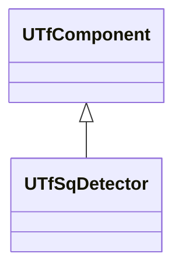
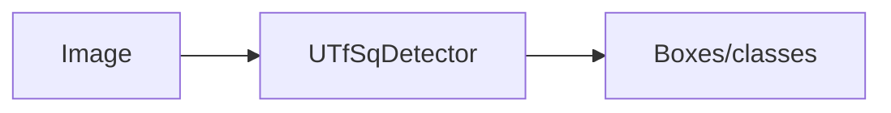
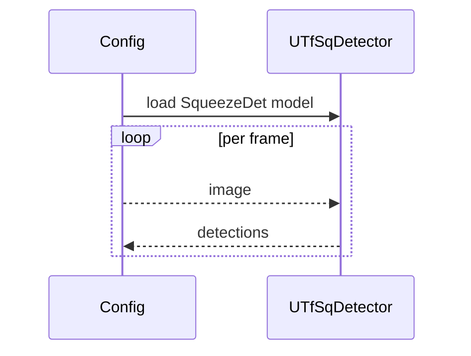

## UTfSqDetector — SqueezeDet на TF

**Класс**: `UTfSqDetector` (`DetectorTFSq`) — детектор на основе SqueezeDet в TF.  
**Регистрация**: `Core/Lib.cpp` → `UploadClass("DetectorTFSq", ...)`.  
**Storage-инстансы**: `ClassName = "DetectorTFSq"`; параметры: модель, anchors, препро/постпроцессинг.

### Входы/выходы
- Вход: изображение/тензор.
- Выход: детекции (boxes/classes/scores).

Пояснение: блок-схема показывает поток данных/сигналов (входы → компонент → выходы).

Пояснение: диаграмма последовательности показывает типовой сценарий взаимодействия и порядок вызовов.

---

## UTfSqDetector — TensorFlow SqueezeDet

Runs SqueezeDet TensorFlow model to produce detections.
