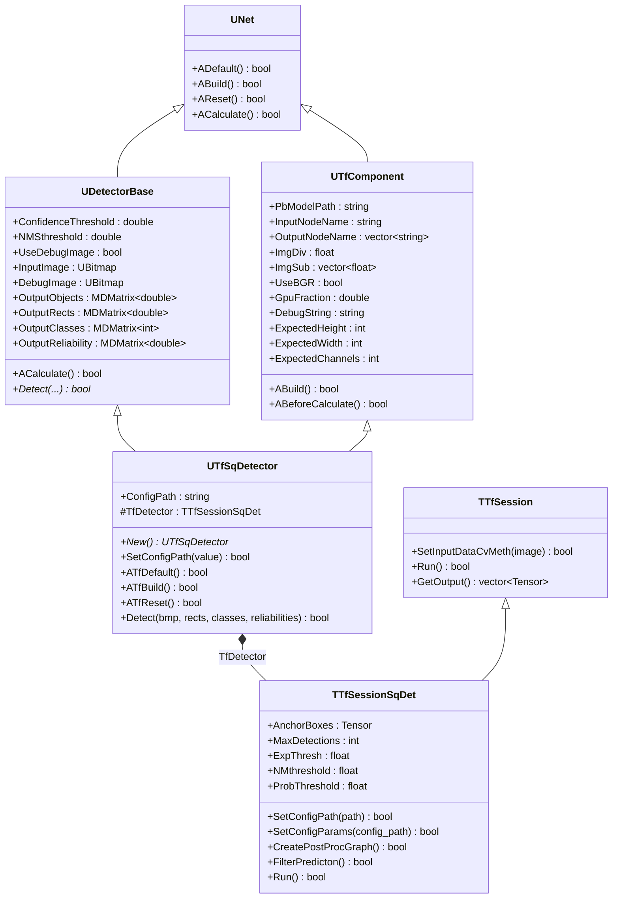
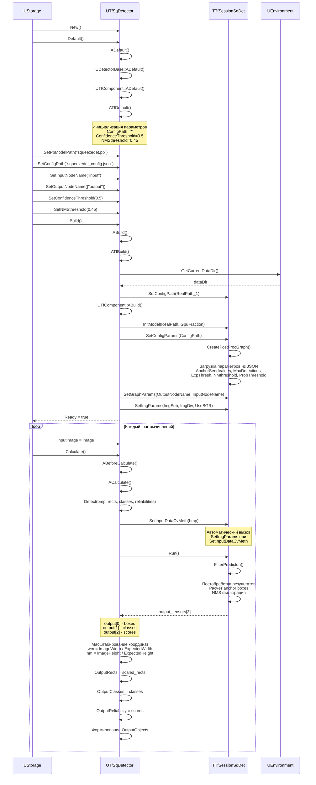
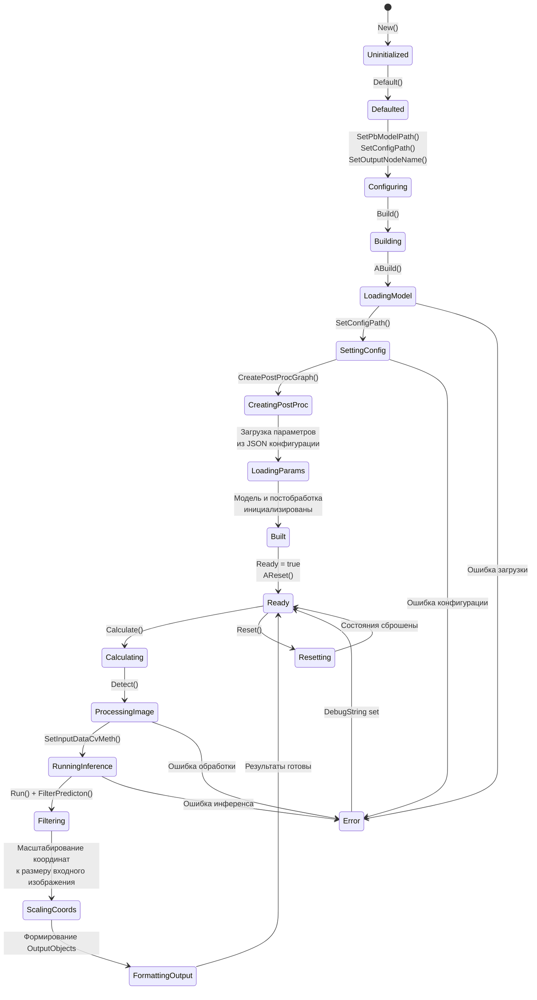
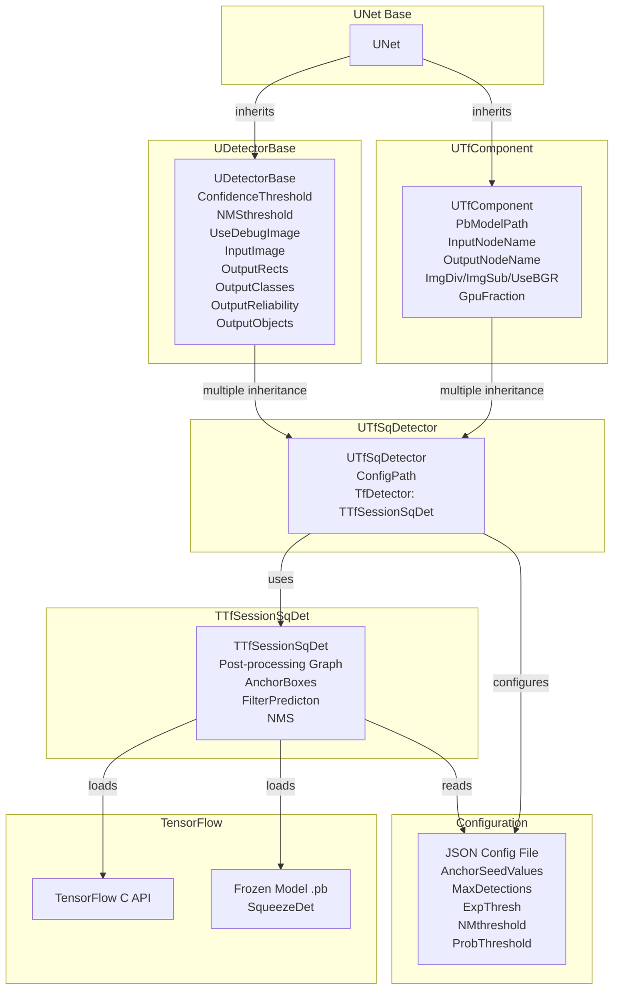
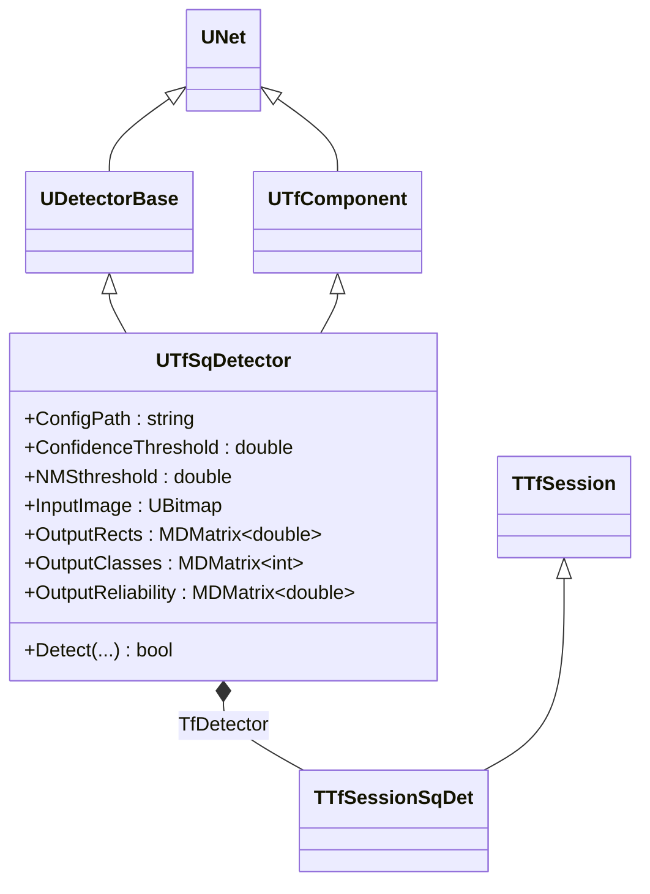
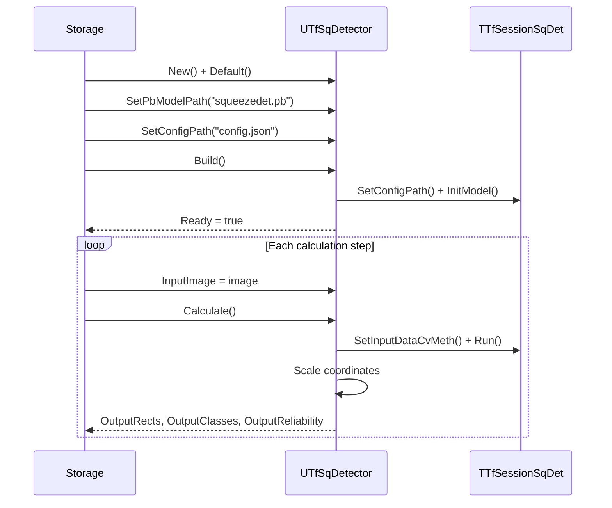

# UTfSqDetector — детектор SqueezeDet TensorFlow

## RU

### Назначение

**Класс**: `UTfSqDetector` (`DetectorTFSq`) — детектор объектов на основе архитектуры SqueezeDet в TensorFlow.  
**Регистрация**: `Core/Lib.cpp` → `UploadClass("DetectorTFSq", ...)`.  
**Storage-инстансы**: `ClassName = "DetectorTFSq"` в `Bin/Configs/*/Model_*.xml`.

`UTfSqDetector` реализует детекцию объектов с использованием предобученных моделей SqueezeDet. В отличие от `UTfDetector`, этот компонент использует специализированную сессию `TTfSessionSqDet`, которая выполняет дополнительную постобработку результатов (расчет anchor boxes, фильтрация предсказаний, NMS) и требует конфигурационный файл с параметрами модели.

### UML-диаграмма классов



**Иерархия наследования:**
- `UNet` — базовый класс сетей компонентов
- `UDetectorBase` — базовый класс детекторов (виртуальное наследование)
- `UTfComponent` — базовый компонент TensorFlow (виртуальное наследование)
- `UTfSqDetector` — детектор SqueezeDet TensorFlow (множественное наследование)
- `TTfSessionSqDet` — специализированная сессия для SqueezeDet (наследует от `TTfSession`)

**Ключевые свойства:**
- Параметры детекции: `ConfidenceThreshold`, `NMSthreshold`
- Конфигурация: `ConfigPath` — путь к конфигурационному файлу SqueezeDet
- Входы: `InputImage`
- Выходы: `OutputRects`, `OutputClasses`, `OutputReliability`, `OutputObjects`

### UML-диаграмма последовательности



**Жизненный цикл:**
1. **Инициализация**: Установка параметров по умолчанию через `ADefault()` и `ATfDefault()`
2. **Настройка**: Установка пути к модели, конфигурационного файла, имен узлов, порогов детекции
3. **Сборка**: Загрузка модели, установка конфигурации, создание графа постобработки через `ABuild()` и `ATfBuild()`
4. **Сброс**: Подготовка к вычислениям через `AReset()` и `ATfReset()`
5. **Вычисления**: Детекция объектов с постобработкой и масштабированием координат через `ACalculate()` и `Detect()`

### UML-диаграмма состояний



**Состояния:**
- **Uninitialized** — создан, но не инициализирован
- **Defaulted** — параметры установлены по умолчанию
- **Configuring** — настройка параметров модели, конфигурации и детекции
- **Building** — выполняется сборка компонента
- **LoadingModel** — загрузка TensorFlow модели
- **SettingConfig** — установка конфигурационного файла
- **CreatingPostProc** — создание графа постобработки
- **LoadingParams** — загрузка параметров из JSON конфигурации (anchor boxes, пороги и т.д.)
- **Built** — структура компонента построена
- **Ready** — готов к выполнению детекции
- **Calculating** — выполняется расчет компонента
- **ProcessingImage** — обработка входного изображения
- **RunningInference** — выполнение инференса TensorFlow
- **Filtering** — постобработка и фильтрация результатов
- **ScalingCoords** — масштабирование координат к размеру входного изображения
- **FormattingOutput** — формирование выходных данных
- **Resetting** — выполняется сброс состояний
- **Error** — ошибка при выполнении операции

### UML-диаграмма активности

```mermaid
flowchart TD
    Start([Start ATfBuild]) --> GetDataDir[Получить GetCurrentDataDir]
    GetDataDir --> BuildConfigPath[Построить RealPath_1 =<br/>dataDir + ConfigPath]
    BuildConfigPath --> SetConfigPath[TfDetector.SetConfigPath<br/>RealPath_1]
    SetConfigPath --> CheckConfigPath{Успешно?}
    CheckConfigPath -->|Нет| ReturnFalse([Return false])
    CheckConfigPath -->|Да| ReturnTrue([Return true])
    
    StartDetect([Start Detect]) --> CheckBuildDone{BuildDone?}
    CheckBuildDone -->|Нет| SetError1[Установить DebugString<br/>Ready = false]
    SetError1 --> ReturnFalse1([Return false])
    CheckBuildDone -->|Да| SetInput[SetInputDataCvMeth<br/>преобразование UBitmap в тензор]
    SetInput --> CheckSetInput{Успешно?}
    CheckSetInput -->|Нет| SetError2[Установить DebugString]
    SetError2 --> ReturnFalse2([Return false])
    CheckSetInput -->|Да| RunInference[Run<br/>выполнение инференса<br/>с постобработкой]
    RunInference --> CheckRun{Успешно?}
    CheckRun -->|Нет| SetError3[Установить DebugString]
    SetError3 --> ReturnFalse3([Return false])
    CheckRun -->|Да| GetNumDetections[num_detections =<br/>output[1].dim_size(0)]
    GetNumDetections --> ResizeOutput[Resize output_rects,<br/>output_classes,<br/>reliabilities]
    ResizeOutput --> CalculateScale[Вычислить масштабы:<br/>wm = InputImage.Width / ExpectedWidth<br/>hm = InputImage.Height / ExpectedHeight]
    CalculateScale --> LoopExtract[Цикл по детекциям]
    LoopExtract --> ExtractBox[Извлечь координаты:<br/>xmin = output[0][y][1] * wm<br/>ymin = output[0][y][0] * hm<br/>xmax = output[0][y][3] * wm<br/>ymax = output[0][y][2] * hm]
    ExtractBox --> ExtractReliability[reliability =<br/>output[2][y]]
    ExtractReliability --> ExtractClass[class =<br/>output[1][y]]
    ExtractClass --> NextExtract{Еще<br/>детекции?}
    NextExtract -->|Да| LoopExtract
    NextExtract -->|Нет| ReturnTrue1([Return true])
```

**Алгоритм детекции (Detect):**
1. Проверка `BuildDone`
2. Преобразование изображения в тензор
3. Выполнение инференса с автоматической постобработкой (включая NMS)
4. Извлечение результатов из выходных тензоров
5. **Масштабирование координат** к размеру входного изображения (ключевое отличие от `UTfDetector`)
6. Заполнение выходных матриц

### UML-диаграмма компонентов



**Зависимости:**
- **Базовые классы**: `UDetectorBase`, `UTfComponent`, `UNet`
- **Внутренний компонент**: `TfDetector` (TTfSessionSqDet)
- **Конфигурация**: JSON файл с параметрами SqueezeDet
- **Внешние библиотеки**: TensorFlow C API, OpenCV, Boost.PropertyTree (для JSON)
- **Входы**: `InputImage` (UBitmap)
- **Выходы**: `OutputRects`, `OutputClasses`, `OutputReliability`, `OutputObjects`

### Свойства

#### Параметры (ptPubParameter)

**От UTfSqDetector:**
- **`ConfigPath`** (string) — путь к конфигурационному файлу SqueezeDet в формате JSON. Файл содержит параметры модели: anchor boxes, пороги фильтрации, максимальное количество детекций и т.д. Путь может быть относительным (относительно `GetCurrentDataDir()`) или абсолютным. Значение по умолчанию: `""`

**От UDetectorBase:**
- **`ConfidenceThreshold`** (double) — порог уверенности для фильтрации детекций. Значение по умолчанию: `0.5`

- **`NMSthreshold`** (double) — порог для Non-Maximum Suppression. Значение по умолчанию: `0.45`

- **`UseDebugImage`** (bool) — флаг создания отладочного изображения. Значение по умолчанию: `false`

**От UTfComponent:**
- **`PbModelPath`** (string) — путь к файлу замороженной модели SqueezeDet (`.pb` файл). Значение по умолчанию: `""`

- **`InputNodeName`** (string) — имя входного узла графа TensorFlow. Значение по умолчанию: `""`

- **`OutputNodeName`** (vector<string>) — вектор имен выходных узлов графа TensorFlow. Для SqueezeDet обычно содержит один элемент. Значение по умолчанию: `{""}`

- **`ImgDiv`** (float) — делитель для нормализации входного изображения. Значение по умолчанию: `255.0`

- **`ImgSub`** (vector<float>) — вектор значений для вычитания из нормализованного изображения. Значение по умолчанию: `{0.0, 0.0, 0.0}`

- **`UseBGR`** (bool) — флаг использования формата BGR вместо RGB. Значение по умолчанию: `false`

- **`GpuFraction`** (double) — доля памяти GPU для использования. Значение по умолчанию: `0.8`

#### Входы (ptPubInput)

**От UDetectorBase:**
- **`InputImage`** (UBitmap) — входное изображение для детекции объектов.

#### Выходы (ptPubOutput)

**От UDetectorBase:**
- **`OutputRects`** (MDMatrix<double>) — матрица координат ограничивающих прямоугольников. Размер: `[num_detections, 4]`. Координаты **масштабированы к размеру входного изображения** (в отличие от `UTfDetector`).

- **`OutputClasses`** (MDMatrix<int>) — матрица классов объектов. Размер: `[num_detections, 1]`.

- **`OutputReliability`** (MDMatrix<double>) — матрица оценок уверенности. Размер: `[num_detections, 1]`.

- **`OutputObjects`** (MDMatrix<double>) — объединенная матрица результатов детекции. Размер: `[num_detections, 6]`.

#### Состояния (ptPubState)

**От UTfComponent:**
- **`DebugString`** (string) — строка с информацией об ошибках или текущем состоянии компонента.

- **`ExpectedHeight`** (int) — ожидаемая высота входного изображения (в пикселях).

- **`ExpectedWidth`** (int) — ожидаемая ширина входного изображения (в пикселях).

- **`ExpectedChannels`** (int) — ожидаемое количество каналов входного изображения.

### Методы

#### Публичные методы

- **`New()`** → `UTfSqDetector*` — создает новый экземпляр класса.

- **`SetConfigPath(const std::string &value)`** → `bool` — устанавливает путь к конфигурационному файлу. Устанавливает `Ready = false`, требует пересборки компонента.

#### Защищенные методы жизненного цикла

- **`ATfDefault()`** → `bool` — инициализирует специфичные параметры по умолчанию. В текущей реализации просто возвращает `true`.

- **`ATfBuild()`** → `bool` — выполняет дополнительную инициализацию при сборке. Выполняет:
  1. Получение пути к директории данных через `GetCurrentDataDir()`
  2. Построение полного пути к конфигурационному файлу
  3. Установка конфигурации через `TfDetector->SetConfigPath()`

- **`ATfReset()`** → `bool` — сбрасывает специфичные состояния. В текущей реализации просто возвращает `true`.

- **`Detect(UBitmap &bmp, MDMatrix<double> &output_rects, MDMatrix<int> &output_classes, MDMatrix<double> &reliabilities)`** → `bool` — выполняет детекцию объектов на изображении с постобработкой и масштабированием координат.

  **Параметры:**
  - `bmp` — входное изображение для детекции
  - `output_rects` — выходная матрица координат (заполняется методом)
  - `output_classes` — выходная матрица классов (заполняется методом)
  - `reliabilities` — выходная матрица оценок уверенности (заполняется методом)

  **Возвращает:** `true` при успешной детекции, `false` при ошибке.

  **Алгоритм:**
  1. Проверка `BuildDone`
  2. Преобразование изображения в тензор
  3. Выполнение инференса с автоматической постобработкой (включая расчет anchor boxes и NMS)
  4. Извлечение результатов из выходных тензоров
  5. **Масштабирование координат** к размеру входного изображения:
     - `wm = InputImage->GetWidth() / ExpectedWidth`
     - `hm = InputImage->GetHeight() / ExpectedHeight`
     - Координаты умножаются на соответствующие масштабы

### Конфигурационный файл SqueezeDet

Конфигурационный файл должен быть в формате JSON и содержать следующие параметры:

```json
{
    "ANCHOR_SEED": [1.0, 2.0, 0.5],
    "ANCHOR_HEIGHT": 32,
    "ANCHOR_WIDTH": 32,
    "ANCHORS": 9,
    "ANCHOR_PER_GRID": 9,
    "MAX_DETECTION": 25,
    "EXP_THRESH": 0.5,
    "NM_THRESH": 0.4,
    "PROB_THRESH": 0.005
}
```

**Параметры:**
- `ANCHOR_SEED` — вектор базовых размеров anchor boxes
- `ANCHOR_HEIGHT`, `ANCHOR_WIDTH` — размеры anchor boxes
- `ANCHORS` — общее количество anchor boxes
- `ANCHOR_PER_GRID` — количество anchor boxes на одну ячейку сетки
- `MAX_DETECTION` — максимальное количество детекций
- `EXP_THRESH` — порог для экспоненциальной функции
- `NM_THRESH` — порог для Non-Maximum Suppression
- `PROB_THRESH` — порог вероятности для фильтрации детекций

### Примеры использования

#### Пример 1: Создание детектора в коде C++

```cpp
// Создание детектора SqueezeDet
auto detector = storage->CreateComponent<UTfSqDetector>();
detector->SetName("SqueezeDetDetector");

// Инициализация
detector->Default();

// Настройка параметров модели
detector->PbModelPath = "models/squeezedet.pb";
detector->ConfigPath = "configs/squeezedet_config.json";
detector->InputNodeName = "input";
detector->OutputNodeName = {"output"};

// Настройка параметров нормализации
detector->ImgDiv = 255.0;
detector->ImgSub = {0.0, 0.0, 0.0};
detector->UseBGR = false;

// Настройка детекции
detector->ConfidenceThreshold = 0.5;
detector->NMSthreshold = 0.45;
detector->UseDebugImage = true;

// Настройка GPU
detector->GpuFraction = 0.8;

// Сборка
detector->Build();

// Проверка готовности
if (!detector->IsReady()) {
    std::cerr << "Error: " << detector->DebugString << std::endl;
    return;
}

// Детекция объектов
UBitmap inputImage;
// ... загрузка изображения ...
detector->InputImage = inputImage;
detector->Calculate();

// Получение результатов
int numDetections = detector->OutputRects->GetRows();
std::cout << "Detected " << numDetections << " objects" << std::endl;

for (int i = 0; i < numDetections; i++) {
    double xmin = detector->OutputRects(i, 0);
    double ymin = detector->OutputRects(i, 1);
    double xmax = detector->OutputRects(i, 2);
    double ymax = detector->OutputRects(i, 3);
    int classId = detector->OutputClasses(i, 0);
    double confidence = detector->OutputReliability(i, 0);
    
    std::cout << "Object " << i << ": Class " << classId 
              << ", Confidence " << confidence
              << ", Box [" << xmin << ", " << ymin 
              << ", " << xmax << ", " << ymax << "]" << std::endl;
}
```

#### Пример 2: Конфигурация XML

```xml
<SqueezeDetDetector Class="DetectorTFSq">
    <Parameters>
        <PbModelPath>models/squeezedet.pb</PbModelPath>
        <ConfigPath>configs/squeezedet_config.json</ConfigPath>
        <InputNodeName>input</InputNodeName>
        <OutputNodeName>
            <elem>output</elem>
        </OutputNodeName>
        <ConfidenceThreshold>0.5</ConfidenceThreshold>
        <NMSthreshold>0.45</NMSthreshold>
        <UseDebugImage>true</UseDebugImage>
        <ImgDiv>255.0</ImgDiv>
        <ImgSub>
            <elem>0.0</elem>
            <elem>0.0</elem>
            <elem>0.0</elem>
        </ImgSub>
        <UseBGR>false</UseBGR>
        <GpuFraction>0.8</GpuFraction>
    </Parameters>
</SqueezeDetDetector>
```

### Использование в конфигурациях

`UTfSqDetector` используется для детекции объектов с использованием архитектуры SqueezeDet:

- **Компактные модели** — SqueezeDet оптимизирован для мобильных устройств и встраиваемых систем
- **Быстрая детекция** — эффективная архитектура для real-time приложений
- **Автоматическая постобработка** — встроенная обработка anchor boxes и NMS

**Типичные значения параметров:**
- **PbModelPath**: `"models/squeezedet.pb"`, `"models/squeezedet_v1.pb"`
- **ConfigPath**: `"configs/squeezedet_config.json"`, `"squeezedet_config.json"`
- **InputNodeName**: `"input"`, `"image_tensor"`
- **OutputNodeName**: `{"output"}`, `{"predictions"}`
- **ConfidenceThreshold**: `0.5` (стандартный)
- **NMSthreshold**: `0.45` (стандартный)
- **UseDebugImage**: `false` (в продакшене), `true` (для отладки)
- **ImgDiv**: `255.0` (для uint8 изображений)
- **ImgSub**: `{0.0, 0.0, 0.0}` (без центрирования)
- **UseBGR**: `false` (для большинства моделей)
- **GpuFraction**: `0.8` (80% памяти GPU)

### Отличия от UTfDetector

1. **Конфигурационный файл**: `UTfSqDetector` требует JSON конфигурационный файл с параметрами модели
2. **Постобработка**: Автоматическая постобработка результатов (расчет anchor boxes, NMS) выполняется внутри `TTfSessionSqDet`
3. **Масштабирование координат**: Координаты автоматически масштабируются к размеру входного изображения
4. **Формат выходных данных**: Выходные тензоры имеют другой формат (3 тензора вместо 4)

### См. также

- [`UTfComponent`](UTfComponent.md) — базовый компонент TensorFlow
- [`UTfClassifier`](UTfClassifier.md) — классификатор TensorFlow
- [`UTfDetector`](UTfDetector.md) — детектор объектов TensorFlow
- [`UDetectorBase`](../../Rdk-CvBasicLib/Docs/Components/DetectorsSegmentators.md) — базовый класс детекторов
- [Architecture.md](../Architecture.md) — архитектура библиотеки
- [Usage-Examples.md](../Usage-Examples.md) — примеры использования

---

## EN

### Purpose

**Class**: `UTfSqDetector` (`DetectorTFSq`) — object detector based on SqueezeDet architecture in TensorFlow.  
**Registration**: `Core/Lib.cpp` → `UploadClass("DetectorTFSq", ...)`.  
**Instances**: `ClassName = "DetectorTFSq"` in `Bin/Configs/*/Model_*.xml`.

`UTfSqDetector` implements object detection using pre-trained SqueezeDet models. Unlike `UTfDetector`, this component uses specialized session `TTfSessionSqDet` that performs additional post-processing (anchor box calculation, prediction filtering, NMS) and requires a configuration file with model parameters.

### UML Class Diagram



### UML Sequence Diagram



### Properties

- `ConfigPath` — path to SqueezeDet configuration JSON file
- `ConfidenceThreshold` — confidence threshold for filtering detections
- `NMSthreshold` — threshold for Non-Maximum Suppression
- `InputImage` — input image for object detection
- `OutputRects` — matrix of bounding box coordinates (scaled to input image size)
- `OutputClasses` — matrix of object class IDs
- `OutputReliability` — matrix of confidence scores
- `OutputObjects` — combined matrix of detection results

### Methods

- `New()` — create new instance
- `SetConfigPath(value)` — set path to configuration file
- `ATfDefault()` — initialize default parameters
- `ATfBuild()` — perform additional initialization (set config path)
- `ATfReset()` — reset component state
- `Detect(bmp, rects, classes, reliabilities)` — detect objects with post-processing and coordinate scaling

### Differences from UTfDetector

1. **Configuration file**: Requires JSON configuration file with model parameters
2. **Post-processing**: Automatic post-processing (anchor boxes, NMS) performed inside `TTfSessionSqDet`
3. **Coordinate scaling**: Coordinates automatically scaled to input image size
4. **Output format**: Different output tensor format (3 tensors instead of 4)

### See Also

- [`UTfComponent`](UTfComponent.md) — base TensorFlow component
- [`UTfClassifier`](UTfClassifier.md) — TensorFlow classifier
- [`UTfDetector`](UTfDetector.md) — TensorFlow detector
- [Architecture.md](../Architecture.md) — library architecture
