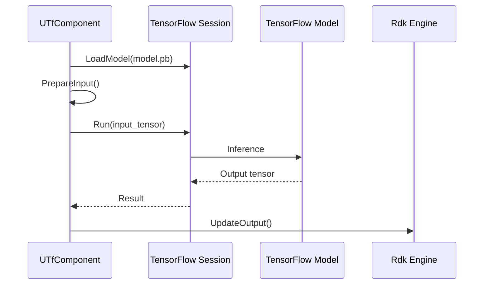
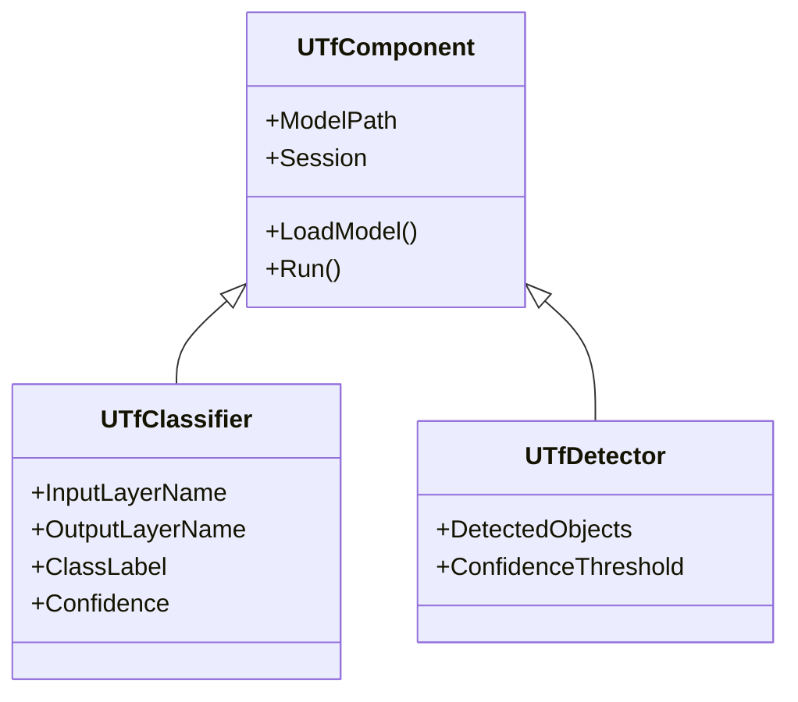

# Пайплайн TensorFlow

## RU

### Интеграция TensorFlow с движком

### Архитектура компонентов TensorFlow

---

## EN

### TensorFlow Integration with Engine

### TensorFlow Components Architecture
