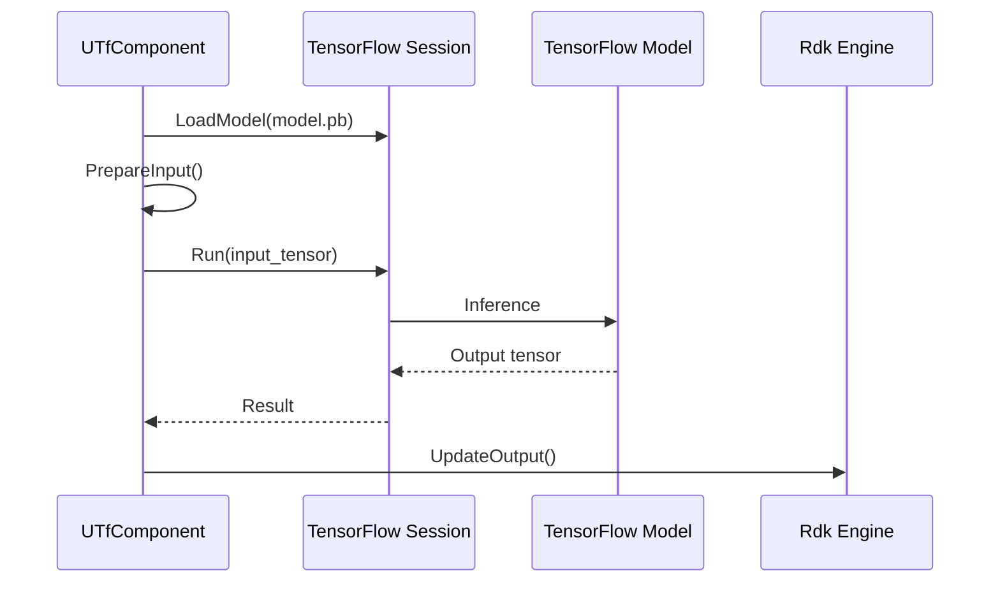
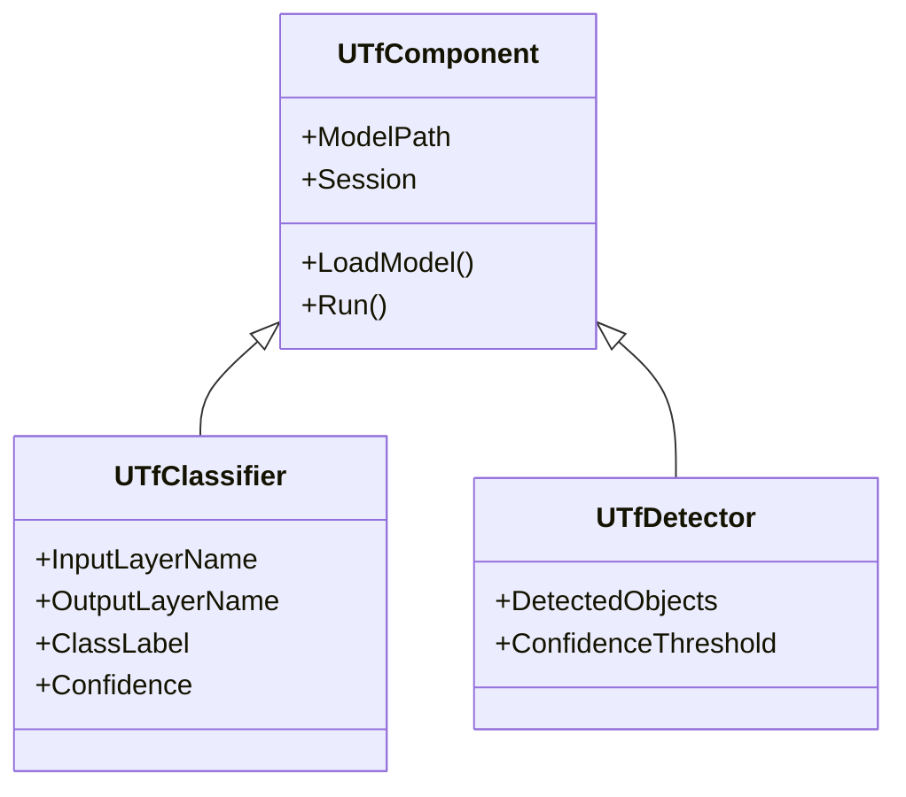

# Пайплайн TensorFlow

## RU

### Интеграция TensorFlow с движком

### Архитектура компонентов TensorFlow

---

Диаграмма показывает типичный процесс использования TensorFlow компонента: загрузка модели из файла `.pb`, подготовка входных данных, выполнение инференса через TensorFlow Session и обновление выходных свойств компонента для передачи данных другим компонентам в движке.

Архитектура компонентов отражает иерархию классов: `UTfComponent` является базовым классом, от которого наследуются специализированные компоненты (`UTfClassifier`, `UTfDetector`, `UTfSqDetector`). Каждый компонент управляет своей TensorFlow Session и использует её для выполнения операций машинного обучения.

## EN

### TensorFlow Integration with Engine

The diagram shows a typical TensorFlow component usage process: loading a model from a `.pb` file, preparing input data, executing inference through TensorFlow Session, and updating component output properties to pass data to other components in the engine.

### TensorFlow Components Architecture

The component architecture reflects the class hierarchy: `UTfComponent` is the base class from which specialized components (`UTfClassifier`, `UTfDetector`, `UTfSqDetector`) inherit. Each component manages its own TensorFlow Session and uses it to perform machine learning operations.
